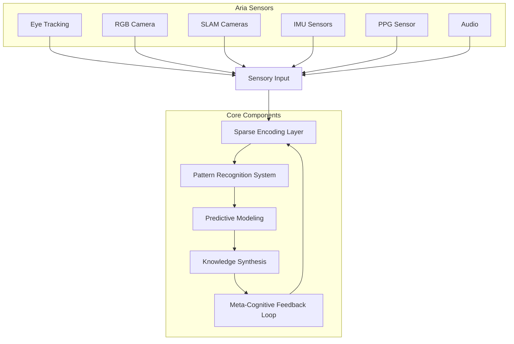
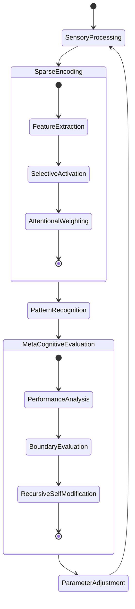
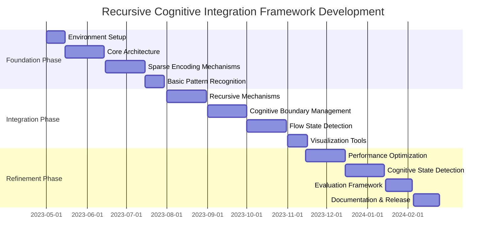

I've reviewed your Project Aria Research Proposal draft on the Recursive Cognitive Integration Framework, and it presents a comprehensive approach to developing an adaptive cognitive architecture that leverages Project Aria's sensor capabilities.

# Development Guidelines for Aria Research Project

## Project Structure Recommendations

Based on your proposal and background, I recommend organizing your implementation with these key components:

```
aria-research/
├── core/                      # Core architecture components
│   ├── sensory/               # Sensory processing modules
│   ├── encoding/              # Sparse encoding implementation
│   ├── recognition/           # Pattern recognition system
│   └── metacognitive/         # Meta-cognitive feedback loops
├── models/                    # ML model implementations
│   ├── mamba/                 # Sequence models for temporal patterns
│   ├── attention/             # Eye-tracking based attention models
│   └── physiological/         # PPG-based state detection
├── integration/               # Aria integration components
│   ├── vrs/                   # VRS data handling
│   ├── mps/                   # Machine Perception Services integration
│   └── sdk/                   # Client SDK implementations
├── visualization/             # Visualization tools
├── evaluation/                # Evaluation frameworks
└── docs/                      # Documentation
```

## Technical Implementation Guidelines

### 1. Development Environment Setup

Given your background in CS with experience in Java, Mojo, and other languages, I recommend:

1. **Initial Setup**
   - Configure a consistent development environment on macOS 15.2 Beta 2
   - Set up version control with branching structure for different components
   - Establish continuous integration for automated testing

2. **Dependencies Management**
   - Use a package manager compatible with your macOS environment
   - Maintain separate virtual environments for Python components
   - Document all dependencies with version requirements

### 2. Core Architecture Implementation

Your proposal's recursive cognitive architecture can be implemented with these priorities:

1. **Sparse Encoding Layer**
   - Implement using Java for core architecture with Mojo for performance
   - Focus on efficient sparse tensor operations
   - Develop adaptive thresholding mechanisms that adjust based on context

2. **Meta-Cognitive Feedback Loop**
   - Design with clear interfaces between components
   - Implement parameter tracking to measure adaptation
   - Build visualization tools for recursive modification

3. **Flow State Detection**
   - Leverage your biopsychology background for physiological marker identification
   - Develop eye-tracking pattern analysis for attention states
   - Create correlation mechanisms between detected markers and self-reported states

### 3. Data Pipeline Design

For the data pipeline handling 2TB of raw data:

1. **Efficient Processing**
   - Implement streaming processing where possible
   - Develop caching mechanisms for frequently accessed patterns
   - Create data versioning for tracking transformations

2. **Modular Components**
   - Design each processing stage with clear inputs/outputs
   - Enable parallel processing where appropriate
   - Implement error handling with graceful degradation

## Integration with Aria Components

### 1. VRS Data Handling

The Visual Recording System format requires specific attention:

```java
// Example Java interface for VRS data handling
public interface VrsDataProvider {
    SensorFrame getNextFrame();
    EyeTrackingData getEyeTrackingData(long timestamp);
    SpatialData getSpatialData(long timestamp);
    PhysiologicalData getPhysiologicalData(long timestamp);
    
    // Meta-cognitive integration
    void registerProcessingFeedback(ProcessingMetrics metrics);
}
```

### 2. MPS Integration

For Machine Perception Services:

1. **SLAM Integration**
   - Develop wrapper classes for SLAM data access
   - Implement spatial mapping with cognitive boundaries
   - Create consistency verification between visual and spatial data

2. **Eye Tracking Processing**
   - Implement attention weighting based on gaze direction
   - Develop fixation pattern analysis for cognitive state detection
   - Create temporal pattern recognition for attention shifts

## Development Process Guidelines

Follow this three-phase approach as outlined in your proposal:

### Phase 1: Foundation (Weeks 1-8)
- Focus on core data structures and basic processing
- Implement minimal viable components for each layer
- Establish evaluation metrics and baselines

### Phase 2: Integration (Weeks 9-16)
- Develop recursive mechanisms
- Implement cognitive boundary management
- Create initial flow state detection components
- Build visualization tools for system monitoring

### Phase 3: Refinement (Weeks 17-24)
- Optimize performance and resource utilization
- Enhance cognitive state detection accuracy
- Develop comprehensive evaluation
- Prepare documentation and research outputs

## Evaluation Framework Implementation

Implement these evaluation methods:

1. **Quantitative Metrics**
   - Prediction accuracy against ground truth
   - Adaptation rate measurements
   - Computational efficiency metrics
   - Boundary flexibility measurements

2. **Qualitative Assessment**
   - User experience with flow state guidance
   - Case studies of system adaptation
   - Visualization of cognitive boundaries

## Mental Health Research Integration

Given your background with anxiety and depression management:

1. **Attention Redirection**
   - Develop mechanisms to identify anxiety-linked attention patterns
   - Create subtle redirection techniques based on eye tracking
   - Implement physiological feedback loops for stress detection

2. **Cognitive Load Management**
   - Design adaptive interfaces that respond to detected cognitive states
   - Implement information presentation that adjusts to mental states
   - Create evaluation metrics for effectiveness in different states

## Documentation Guidelines

Maintain comprehensive documentation:

1. **Code Documentation**
   - Document all interfaces and key implementations
   - Create architecture diagrams showing component relationships
   - Maintain up-to-date dependency documentation

2. **Research Documentation**
   - Document theoretical principles behind implementations
   - Create visualization of cognitive processes
   - Track system evolution through recursive cycles

By following these guidelines, you'll create a well-structured implementation that effectively realizes the vision outlined in your proposal, while leveraging your unique background in biopsychology and computer science.


Let me review the content in these files to provide a comprehensive analysis.

Read file: MainDoc/# Project Aria Research Proposal- Recursive Cognitive Integration Framework draft 2.md

Read file: MainDoc/# Project Aria Research Proposal.md
Based on my review of the provided files, I can see the Project Aria Research Proposal focuses on developing a Recursive Cognitive Integration Framework that leverages Project Aria's sensor capabilities. The claude-draft2-additions.md file provides development guidelines and project structure recommendations that complement the main research proposal.

Read file: MainDoc/claude-draft2-additions.md

Ran tool

Ran tool
Here's a comprehensive analysis of the Project Aria Research Proposal files and the implementation recommendations:

# Project Aria Recursive Cognitive Integration Framework

## System Architecture Visualization



## Implementation Structure

The proposed `aria-research/` directory structure effectively organizes the implementation into clear functional components:

```
aria-research/
├── core/                      # Core architecture components
│   ├── sensory/               # Sensory processing modules
│   ├── encoding/              # Sparse encoding implementation
│   ├── recognition/           # Pattern recognition system
│   └── metacognitive/         # Meta-cognitive feedback loops
├── models/                    # ML model implementations
│   ├── mamba/                 # Sequence models for temporal patterns
│   ├── attention/             # Eye-tracking based attention models
│   └── physiological/         # PPG-based state detection
├── integration/               # Aria integration components
├── visualization/             # Visualization tools
├── evaluation/                # Evaluation frameworks
└── docs/                      # Documentation
```

## State Diagram of System Processing Flow



## Development Timeline



## Key Technical Implementations

The claude-draft2-additions.md file offers essential implementation guidance that complements the theoretical framework in the main proposal:

1. **VRS Data Handling Interface** - The proposed Java interface provides a clean abstraction for accessing the multi-modal sensor data from Project Aria, with the metacognitive feedback integration being particularly important for the recursive architecture.

2. **Development Phases** - The three-phase approach (Foundation, Integration, Refinement) aligns perfectly with the recursive nature of the framework, allowing each phase to build upon and refine the previous work.

3. **Technical Stack Recommendations** - The suggested use of Java with Mojo for performance-critical components, alongside Python for model implementations, provides an appropriate balance between performance and development efficiency.

## Implementation Priorities

Based on the proposal and development guidelines, these implementation priorities emerge:

1. **Sparse Encoding Layer** - This forms the foundation of the entire architecture, transforming multi-modal sensory data into efficient representations that mimic human attentional processes.

2. **Meta-Cognitive Feedback Loop** - The core innovation enabling true recursive self-modification rather than just iterative processing.

3. **Eye Tracking Integration** - Critical for implementing the attentional weighting that drives the sparse encoding process and flow state detection.

4. **Dynamic Boundary Management** - Enables the system to adapt its conceptual categories based on both environmental context and internal performance evaluation.

## Mental Health Research Applications

The framework's potential application to anxiety and depression management is particularly promising:

1. **Attention Redirection** - Using eye tracking to identify anxiety-linked attention patterns and implement subtle redirection techniques.

2. **Cognitive Load Management** - Developing adaptive interfaces that respond to detected cognitive states, potentially helping manage overwhelming situations.

3. **Flow State Facilitation** - Identifying environmental conditions conducive to flow states and guiding users toward these optimal cognitive experiences.

This project represents a sophisticated integration of cognitive neuroscience principles with advanced computational techniques, leveraging Project Aria's unique sensory capabilities to create a truly adaptive cognitive architecture.
