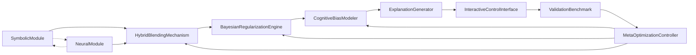

# Improved Hybrid Reasoning System - YAML Tag Definitions

## 🚀 Overview

This repository contains enhanced YAML tag definitions for a hybrid AI reasoning system that combines symbolic logic with neural heuristics. The system has been significantly improved based on comprehensive analysis to address critical issues in **recursion safety**, **type validation**, **error handling**, and **extensibility**.

## 📁 Files

- **`improved_hybrid_reasoning_system.yaml`** - Main YAML configuration with enhanced tag definitions
- **`improvement_summary.md`** - Detailed analysis and explanation of all improvements
- **`validation_example.py`** - Python script demonstrating validation capabilities
- **`README.md`** - This documentation file

## 🎯 Key Improvements

### ✅ **Recursion Safety**
- **Problem**: Original system had ambiguous "adaptive" recursion limits
- **Solution**: Implemented `bounded_adaptive` recursion control with:
  - Maximum iteration limits
  - Convergence thresholds
  - Timeout mechanisms
  - Multiple termination conditions
  - User intervention capabilities

### ✅ **Input/Output Schemas**
- **Problem**: Lack of explicit data structure specifications
- **Solution**: Comprehensive schema definitions for all components:
  - Type safety validation
  - Required field checking
  - Range and enum constraints
  - Cross-component data format specifications

### ✅ **Default Values & Configuration**
- **Problem**: No practical default values provided
- **Solution**: Comprehensive default configurations:
  - Ready-to-use parameter values
  - Reasonable ranges and constraints
  - Enumerated options for categorical parameters

### ✅ **Error Handling**
- **Problem**: No explicit error handling strategies
- **Solution**: Robust error management system:
  - Explicit failure mode identification
  - Configurable timeout and retry policies
  - Multiple fallback strategies
  - Component-specific error handling

### ✅ **Enhanced Extensibility**
- **Problem**: Limited extensibility for new components
- **Solution**: Modular design patterns:
  - Reusable attribute types
  - Schema references and inheritance
  - Standardized patterns across components

## 🏗️ System Architecture

The system consists of 9 main components:

1. **SymbolicModule** - Formal logic reasoning (SAT/SMT solvers)
2. **NeuralModule** - Pattern-based neural predictions
3. **HybridBlendingMechanism** - Combines symbolic and neural outputs
4. **BayesianRegularizationEngine** - Applies cognitive and efficiency constraints
5. **CognitiveBiasModeler** - Simulates human reasoning patterns
6. **MetaOptimizationController** - Automatic parameter tuning
7. **ExplanationGenerator** - Produces human-readable explanations
8. **InteractiveControlInterface** - User interaction and control
9. **ValidationBenchmark** - System validation and testing

## 🔧 Usage

### Basic Configuration

```yaml
# Example configuration snippet
tags:
  - name: SymbolicModule
    attributes:
      - name: logic_domain
        type: string
        default_value: "propositional"
        enum: ["propositional", "first-order", "SMT"]
      - name: completeness_guarantee
        type: boolean
        default_value: true
```

### Validation

Run the validation script to check your configuration:

```bash
python3 validation_example.py
```

Example output:
```
🔍 Hybrid Reasoning System - Validation Demo
==================================================
=== Schema Validation Demo ===

--- Valid Data ---
✅ Validation PASSED

--- Invalid Data ---
❌ Validation FAILED

Errors:
  - Field 'problem_statement' must be a string
  - Field 'timeout_ms' value 500000 is outside range [1000, 300000]

=== Validating Configuration File: improved_hybrid_reasoning_system.yaml ===
✅ Validation PASSED

🎯 Validation Benefits Demonstrated:
  ✅ Recursion safety enforcement
  ✅ Type safety validation
  ✅ Range and enum checking
  ✅ Required field validation
  ✅ Error handling verification
  ✅ Default value consistency
```

## 🔄 Data Flow

The system follows a structured data flow:



## 🛡️ Safety Features

### Recursion Safety
```yaml
recursion_depth_limit: 
  type: "bounded_adaptive"
  max_iterations: 100
  convergence_threshold: 0.01
  timeout_minutes: 60
  termination_conditions:
    - "convergence_achieved"
    - "max_iterations_reached"
    - "timeout_exceeded"
    - "user_intervention"
```

### Error Handling
```yaml
error_handling:
  timeout_seconds: 300
  max_retries: 2
  fallback_strategy: "graceful_degradation"

failure_modes:
  - "timeout"
  - "resource_exhaustion"
  - "no_proof_found"
  - "malformed_input"
```

## 🎮 Interactive Control

Users can adjust key parameters in real-time:

- **α (alpha)**: Balance between symbolic and neural reasoning
- **λ₁ (lambda1)**: Cognitive regularization weight
- **λ₂ (lambda2)**: Efficiency regularization weight
- **β (beta)**: Cognitive bias simulation parameter

## 📊 Validation Framework

The system includes comprehensive validation:

- **Empirical benchmarking** against baseline methods
- **Formal proof checking** for correctness
- **Adversarial robustness testing** for reliability
- **User feedback loops** for continuous improvement

## 🚀 Getting Started

1. **Install Dependencies**:
   ```bash
   pip install pyyaml
   ```

2. **Load Configuration**:
   ```python
   import yaml
   with open('improved_hybrid_reasoning_system.yaml', 'r') as f:
       config = yaml.safe_load(f)
   ```

3. **Run Validation**:
   ```bash
   python3 validation_example.py
   ```

4. **Implement Components**: Start with core modules and build incrementally

## 🔮 Future Enhancements

- **Hierarchical tag inheritance** for better code reuse
- **Dynamic schema evolution** for runtime adaptability
- **Performance optimization** based on real-world usage
- **Extended cognitive bias models** for better human alignment
- **Multi-modal reasoning** support (text, images, etc.)

## 🤝 Contributing

1. Follow the established schema patterns
2. Ensure all new components have proper error handling
3. Add comprehensive validation tests
4. Update documentation for new features
5. Maintain backward compatibility where possible

## 📜 License

This project is designed for research and educational purposes. Please ensure appropriate licensing for production use.

## 🙏 Acknowledgments

This improvement builds upon comprehensive analysis of the original hybrid reasoning system, addressing key areas for enhanced safety, reliability, and usability in production environments.

---

**Ready to build sophisticated AI reasoning systems that combine the best of symbolic logic and neural networks!** 🧠⚡
