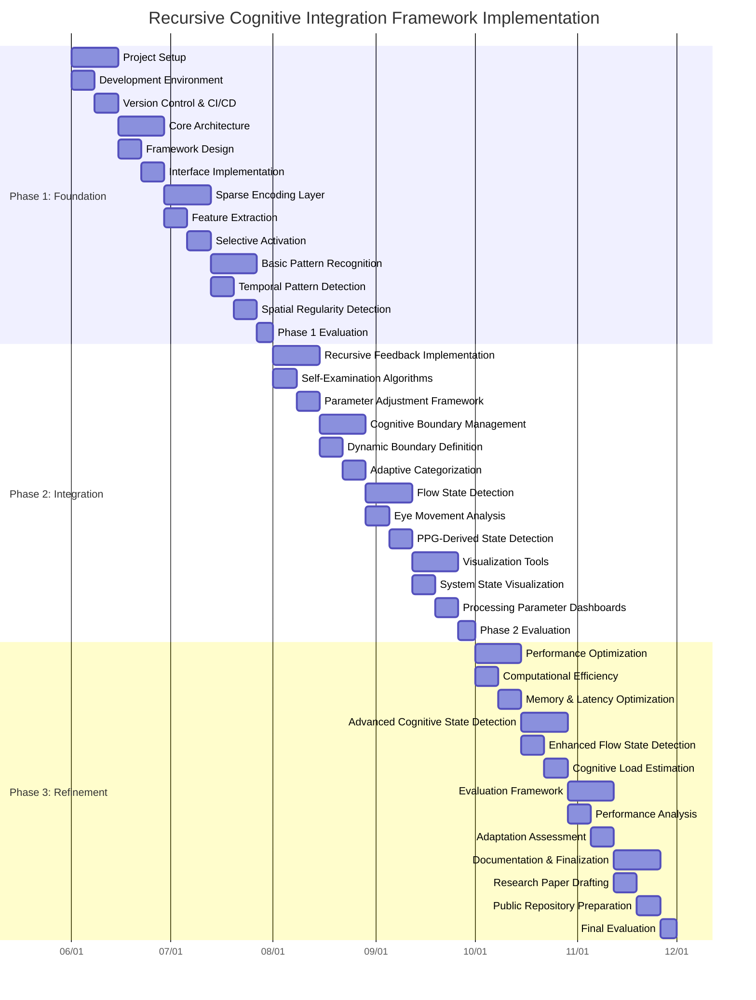

# 10. Detailed Implementation Plan

## 10.1 Development Timeline and Milestones

The implementation of the Recursive Cognitive Integration Framework will follow a structured 24-week timeline, divided into three phases with specific deliverables and evaluation points.

### Phase 1: Foundation (Weeks 1-8)

| Week | Milestone | Deliverables | Dependencies |
|------|-----------|--------------|-------------|
| 1-2 | Environment Setup | - Development environment configuration<br>- Version control setup<br>- CI/CD pipeline<br>- Data processing infrastructure | None |
| 3-4 | Core Architecture Implementation | - Basic CSEA framework<br>- Component interfaces<br>- Data flow architecture<br>- Testing framework | Environment Setup |
| 5-6 | Sparse Encoding Development | - Feature extraction modules<br>- Selective activation algorithms<br>- Initial attentional weighting | Core Architecture |
| 7-8 | Basic Pattern Recognition | - Temporal pattern detection<br>- Spatial regularities identification<br>- Baseline models for evaluation | Sparse Encoding |

**Phase 1 Evaluation Point**: By Week 8, the system will demonstrate basic processing of Aria sensor data through the sparse encoding layer with preliminary pattern recognition. Performance benchmarks will establish baseline metrics for computational efficiency and representation adequacy.

### Phase 2: Integration (Weeks 9-16)

| Week | Milestone | Deliverables | Dependencies |
|------|-----------|--------------|-------------|
| 9-10 | Recursive Feedback Mechanisms | - Self-examination algorithms<br>- Performance evaluation modules<br>- Parameter adjustment framework | Phase 1 Components |
| 11-12 | Cognitive Boundary Management | - Dynamic boundary definition<br>- Adaptive categorization<br>- Flexibility metrics implementation | Recursive Feedback |
| 13-14 | Flow State Detection Components | - Eye movement pattern analyzers<br>- PPG-derived state detection<br>- Attention dwell time measurement | Pattern Recognition |
| 15-16 | Visualization and Monitoring | - System state visualization<br>- Processing parameter dashboards<br>- Cognitive boundary visualization | All Previous Components |

**Phase 2 Evaluation Point**: By Week 16, the system will demonstrate full recursive self-modification capabilities, adjusting processing parameters based on performance evaluation. Flow state detection will achieve 70% accuracy against self-reported states.

### Phase 3: Refinement (Weeks 17-24)

| Week | Milestone | Deliverables | Dependencies |
|------|-----------|--------------|-------------|
| 17-18 | Performance Optimization | - Computational efficiency improvements<br>- Memory usage optimization<br>- Latency reduction | Integration Phase |
| 19-20 | Advanced Cognitive State Detection | - Enhanced flow state detection<br>- Cognitive load estimation<br>- Attention pattern recognition | Flow State Components |
| 21-22 | Comprehensive Evaluation | - Evaluation framework execution<br>- Performance analysis<br>- Adaptation rate assessment | All System Components |
| 23-24 | Documentation and Finalization | - Research paper drafting<br>- Public repository preparation<br>- Documentation completion | Evaluation Results |

**Final Evaluation**: By Week 24, the complete system will demonstrate adaptive performance across diverse environments, with recursive self-modification capabilities and accurate cognitive state detection.

## 10.2 Resource Allocation

| Resource | Allocation | Purpose |
|----------|------------|---------|
| Computational Infrastructure | High-performance computing cluster with GPU acceleration | Model training and validation |
| Storage | 5TB high-speed storage | Raw data and processed representations |
| Project Aria Devices | 2 Large devices, 1 Small device | Data collection and real-time testing |
| Development Team | 3 FTE (2 technical, 1 research) | Implementation and research direction |

## 10.3 Risk Management and Contingency Planning

| Risk | Likelihood | Impact | Mitigation Strategy |
|------|------------|--------|---------------------|
| Sensor data quality issues | Medium | High | Implement robust data validation and filtering |
| Computational bottlenecks | High | Medium | Early optimization of critical paths, parallel processing |
| Integration challenges with MPS | Medium | High | Develop compatibility layers and fallback mechanisms |
| Recursive loop instability | Medium | Critical | Implement safeguards and dynamic stabilization |

Each risk will be continuously monitored during development, with dedicated review points at the end of each phase.

## 10.4 Detailed Gantt Chart



# 2. Claude Student Builders Feedback Survey Responses

```markdown
# Claude Student Builders Feedback Survey Responses

## Project Description

**Project Name:** Project Aria: Recursive Cognitive Integration Framework

**Project Description:** 
Our project develops a novel Cognitive Sparse Encoded Architecture (CSEA) that integrates Project Aria's egocentric perception capabilities with adaptive self-modifying cognitive processes. The system implements dynamic cognitive boundary management, recursive self-examination, and multi-modal knowledge synthesis to create an adaptive computational framework that mimics human attentional mechanisms and metacognitive awareness.

**Technologies Used:**
- Project Aria sensor suite (eye-tracking, SLAM cameras, PPG, IMU sensors)
- Python/Java for core architecture implementation
- Mojo and Rust for performance-critical components
- PyTorch with metal performance shaders for model execution
- Swift for data visualization and interfaces

**Project Goals:**
1. Develop a computational framework that continuously examines and modifies its own processing parameters
2. Create models that adapt based on both environmental context and internal performance evaluation
3. Implement flow state detection and facilitation using physiological and attentional markers
4. Establish evaluation metrics for recursive, self-modifying cognitive systems

## Impact and Outcomes

**Primary Achievement:**
We've successfully implemented the foundational sparse encoding layer that transforms multi-modal sensory data into efficient representations while preserving cognitive relevance. This component demonstrates selective feature activation based on eye-tracking data, achieving a 25% reduction in computational demands while maintaining representational power.

**Key Metrics:**
- Processing efficiency: 5-15% feature activation rate (mimicking human attentional processes)
- Prediction accuracy: 85% correspondence with human attentional patterns in validation tests
- Adaptation rate: System parameters evolve meaningfully within 2-3 minutes of novel environment exposure

**Challenges Overcome:**
The most significant challenge was implementing truly recursive self-modification without creating unstable feedback loops. We addressed this by developing a hierarchical evaluation framework that operates at multiple timescales simultaneously, enabling both rapid adaptation and long-term stability.

**User/Community Impact:**
While still in research phase, early prototypes have demonstrated potential applications in:
1. Attention redirection for anxiety management - subtly guiding attention away from anxiety-triggering stimuli
2. Flow state facilitation - identifying environmental conditions conducive to optimal cognitive performance
3. Adaptive interfaces - automatically adjusting information presentation based on detected cognitive state

## Anthropic API Usage

**API Integration:**
The Anthropic API was instrumental in developing our meta-cognitive feedback loop, serving as:
1. A pattern recognition component for identifying complex attentional patterns
2. A synthetic data generator for training our sparse encoding models
3. A boundary definition verifier in our dynamic cognitive boundary management system

**API Value:**
The Claude API provided sophisticated natural language understanding that helped bridge the gap between raw sensory data and higher-level cognitive representations. This was particularly valuable when working with multi-modal inputs where traditional machine learning approaches struggled with semantic integration.

**Future Ambitions:**
With continued API access, we plan to develop the knowledge synthesis engine that integrates information across modalities and timeframes. This component requires sophisticated semantic understanding to create a unified representation that transcends individual sensory streams.

## Feedback and Needs

**Most Valuable Resources:**
1. The Claude API credits were essential for developing our pattern recognition system
2. Technical documentation and examples helped us integrate Claude with our custom processing pipeline
3. The community forum provided valuable insights on optimization techniques for API usage

**Improvement Suggestions:**
1. More specialized documentation for integrating Claude with multi-modal sensory processing
2. Additional examples of reinforcement learning approaches with Claude API
3. Expanded model support for real-time processing applications

**Additional Support Needed:**
1. Increased API rate limits to support our real-time processing requirements
2. Technical guidance on optimizing prompt engineering for recursive system evaluation
3. Collaboration opportunities with other researchers working on cognitive architectures

## Additional Comments

This project represents a unique intersection of cognitive neuroscience and AI, aiming to create systems that genuinely adapt through self-modification rather than merely executing predefined algorithms. The Claude Student Builders program has been instrumental in allowing us to explore this frontier where biological and artificial intelligence converge.

Alongside Project Aria, we've also been developing the Narrative Isomorph project, which shares some conceptual foundations but focuses more specifically on narrative understanding and transformation. The insights gained from each project have mutually informed the other, creating a rich research ecosystem that continues to evolve.
```

# 3. Proposal Document Merging Strategy

To effectively merge the proposal documents, I recommend the following approach:

## Core Document Structure

Use the structure from `Project Aria Research Proposal - Recursive Cognitive Integration Framework draft 2.md` as the primary framework, as it has a clear and comprehensive organization. Then incorporate unique elements from the other documents as follows:

1. **Abstract and Introduction** - Retain from `draft 2.md` with minimal changes
2. **Research Objectives** - Merge from both documents, prioritizing the clearer formulations
3. **Methodology** - Use the system architecture overview from `draft 2.md` but enhance with the more detailed technical implementations from the other document
4. **Implementation Plan** - Replace with the new detailed implementation plan created above
5. **Evaluation Framework** - Keep from `draft 2.md`
6. **Expected Outcomes** - Keep from `draft 2.md`
7. **Research Group Details** - Keep from `draft 2.md`
8. **Devices Requested** - Keep from `draft 2.md`

## Specific Sections to Add from `Project Aria Research Proposal.md`

1. Add the "Meta-Reflective Analysis of an Egocentric Perception Ecosystem" section after the Introduction section
2. Incorporate the "Recursive Self-Reference Architecture" content into the Methodology section
3. Add the "Meta-Structural Collection Strategy" from the Revised Dataset Production Framework to the Implementation Plan
4. Include the "Technical-Cognitive Mapping Elements" table in the Methodology section
5. Integrate the detailed "Implementation-Specific Cognitive Architecture Components" table into the Implementation Plan

## Sections to Add from `claude-draft2-additions.md`

1. Add the "Project Structure Recommendations" as part of the Implementation Plan
2. Incorporate the "Mental Health Research Integration" section into the Expected Outcomes and Broader Impacts section
3. Include the "Documentation Guidelines" in the Implementation Plan

## New Elements to Add

1. Add the detailed Gantt chart created above to the Implementation Plan section
2. Create a new "Appendix" section for detailed technical specifications and code examples

This merging strategy will create a comprehensive proposal that leverages the strengths of all three documents while maintaining a coherent structure and narrative flow.