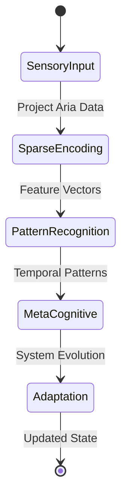

omprehensive draft that integrates the cognitive architecture framework with the meta-cognitive principles. Here's the draft:

# Cognitive Architecture Integration Framework (CAIF)
Version 2.0 - March 2025

## 1. Executive Summary

This framework presents an integrated approach to cognitive architecture development, combining Project Aria's sensory capabilities with advanced meta-cognitive processing. The system implements a novel Cognitive Sparse Encoded Architecture (CSEA) that enables dynamic, self-modifying cognitive processes through recursive analysis and adaptation.

## 2. Core Architectural Components

### 2.1 Sensory Integration Layer
```python
class SensoryIntegrationLayer:
    def __init__(self):
        self.sparse_encoder = MambaSparseEncoder(
            input_dim=512,
            selective_activation=True,
            adaptation_rate=0.3
        )
        self.feature_extractor = MultiModalFeatureExtractor(
            modalities=['visual', 'spatial', 'motion', 'audio'],
            integration_depth=3
        )
```

### 2.2 Cognitive Processing Pipeline


### 2.3 Meta-Cognitive Framework
```yaml
meta_cognitive_system:
  components:
    - recursive_analysis:
        depth: "dynamic"
        adaptation_rate: 0.3
        boundary_management: "flexible"
    - self_modification:
        parameters: ["thresholds", "integration_depth", "attention_focus"]
        feedback_loops: ["immediate", "longitudinal"]
```

## 3. Implementation Strategy

### 3.1 Data Processing Flow
1. Raw Sensory Input (Project Aria)
   - RGB Camera (30fps)
   - SLAM Cameras (30fps)
   - Eye Tracking (10fps)
   - IMU Sensors (1000Hz)
   - Audio (30kHz stereo)

2. Sparse Encoding Layer
   - Selective feature activation
   - Dimensionality reduction (512-dim)
   - Multi-modal integration

3. Pattern Recognition
   - Temporal-spatial regularities
   - State transition prediction
   - Behavioral pattern analysis

4. Meta-Cognitive Processing
   - Self-examination loops
   - Parameter adjustment
   - Boundary refinement

### 3.2 Integration Vectors
```python
class IntegrationVectors:
    def __init__(self):
        self.memory_vector = LongTermMemoryVector(
            emotional_valence=True,
            temporal_context=True
        )
        self.cognitive_vector = RecursiveThoughtVector(
            bias_aware=True,
            meta_examination=True
        )
        self.behavioral_vector = AdaptiveBehaviorVector(
            feedback_loops=True,
            state_transitions=True
        )
```

## 4. Adaptive Capabilities

### 4.1 Dynamic Boundary Management
- Flexible perceptual-conceptual boundaries
- Context-aware adaptation
- Multi-modal integration thresholds

### 4.2 Recursive Self-Examination
- Meta-cognitive feedback loops
- Parameter self-modification
- Performance optimization

### 4.3 Knowledge Synthesis
- Cross-domain integration
- Temporal pattern recognition
- Emergent understanding formation

## 5. Technical Implementation

### 5.1 Core Components
```python
class CognitiveSystem:
    def __init__(self):
        self.sensory = SensoryIntegrationLayer()
        self.memory = LongTermMemorySystem()
        self.meta = MetaCognitiveProcessor()
        self.behavior = AdaptiveBehaviorSystem()
```

### 5.2 Processing Pipeline
1. Sensory Processing
2. Pattern Recognition
3. Cognitive Integration
4. Meta-Analysis
5. System Evolution

## 6. Evaluation Framework

### 6.1 Performance Metrics
- State prediction accuracy
- Cognitive plasticity maintenance
- Integration depth assessment
- Adaptation rate measurement

### 6.2 Quality Metrics
- User experience coherence
- System responsiveness
- Resource efficiency
- Learning effectiveness

## 7. Future Directions

### 7.1 Research Extensions
- Advanced meta-cognitive models
- Enhanced temporal processing
- Deeper recursive capabilities

### 7.2 Technical Enhancements
- Improved sparse encoding
- Faster state transitions
- Better resource optimization

## 8. Appendices

### 8.1 Implementation Notes
```python
# Key configuration parameters
CONFIG = {
    'sensory': {
        'input_dim': 512,
        'adaptation_rate': 0.3,
        'integration_depth': 3
    },
    'cognitive': {
        'recursive_depth': 'dynamic',
        'boundary_flexibility': 0.4,
        'meta_learning_rate': 0.1
    }
}
```

### 8.2 System Requirements
- Project Aria hardware compatibility
- Processing capabilities
- Memory requirements
- Network connectivity

Would you like me to expand on any particular section or provide more detailed implementation specifics?
