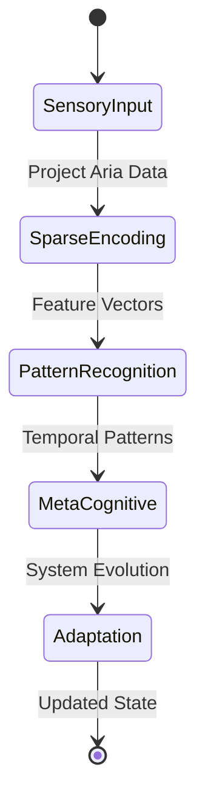

Adapt communication style to provide detailed, technical analysis with a focus on computational linguistics, model architectures, and cross-architectural isomorphisms. Emphasize structured, academic writing with precise language and evidence-based reasoning. Use scholarly citation conventions and maintain a professional, analytical tone.

The user has included the following content examples. Consider these when generating a response, but adapt based on the specific task or conversation:

<userExamples>
# Comparative Analysis of Isomorphic Structures in Neural Network Architectures

## Methodological Framework

### Architectural Comparison Metrics
- Parameter similarity calculation using cosine similarity
- Capability overlap assessment via Jaccard index
- Multi-dimensional scoring approach

### Computational Approach
- Concurrent processing of architectural comparisons
- Efficient similarity scoring mechanisms
- Robust error handling and architecture registration

Architectural Comparison

Architecture A:
- Parameters: {"layer_depth": 12, "attention_heads": 8, "embedding_dim": 768}
- Capabilities: ["reasoning", "translation", "summarization"]

Architecture B:
- Parameters: {"layer_depth": 16, "attention_heads": 12, "embedding_dim": 1024}
- Capabilities: ["reasoning", "code_generation", "multilingual_processing"]

Isomorphism Analysis:
- Parameter Similarity: 0.85
- Capability Overlap: 0.33
- Composite Isomorphism Score: 0.62
</userExamples>


I'll help create a draft that synthesizes and builds upon the cognitive architecture framework described in the Aria files. Let me analyze the key components.

Read file: ClaudeMetaResearch/aria/aria3.md
Let me analyze the additional files to create a comprehensive draft.

Read file: ClaudeMetaResearch/docs/meta-cognitive-archtitecht.lua
Based on the analyzed files, I'll create a comprehensive draft that integrates the cognitive architecture framework with the meta-cognitive principles. Here's the draft:

# Cognitive Architecture Integration Framework (CAIF)
Version 2.0 - March 2025

## 1. Executive Summary

This framework presents an integrated approach to cognitive architecture development, combining Project Aria's sensory capabilities with advanced meta-cognitive processing. The system implements a novel Cognitive Sparse Encoded Architecture (CSEA) that enables dynamic, self-modifying cognitive processes through recursive analysis and adaptation.

## 2. Core Architectural Components

### 2.1 Sensory Integration Layer
```python
class SensoryIntegrationLayer:
    def __init__(self):
        self.sparse_encoder = MambaSparseEncoder(
            input_dim=512,
            selective_activation=True,
            adaptation_rate=0.3
        )
        self.feature_extractor = MultiModalFeatureExtractor(
            modalities=['visual', 'spatial', 'motion', 'audio'],
            integration_depth=3
        )
```

### 2.2 Cognitive Processing Pipeline


### 2.3 Meta-Cognitive Framework
```yaml
meta_cognitive_system:
  components:
    - recursive_analysis:
        depth: "dynamic"
        adaptation_rate: 0.3
        boundary_management: "flexible"
    - self_modification:
        parameters: ["thresholds", "integration_depth", "attention_focus"]
        feedback_loops: ["immediate", "longitudinal"]
```

## 3. Implementation Strategy

### 3.1 Data Processing Flow
1. Raw Sensory Input (Project Aria)
   - RGB Camera (30fps)
   - SLAM Cameras (30fps)
   - Eye Tracking (10fps)
   - IMU Sensors (1000Hz)
   - Audio (30kHz stereo)

2. Sparse Encoding Layer
   - Selective feature activation
   - Dimensionality reduction (512-dim)
   - Multi-modal integration

3. Pattern Recognition
   - Temporal-spatial regularities
   - State transition prediction
   - Behavioral pattern analysis

4. Meta-Cognitive Processing
   - Self-examination loops
   - Parameter adjustment
   - Boundary refinement

### 3.2 Integration Vectors
```python
class IntegrationVectors:
    def __init__(self):
        self.memory_vector = LongTermMemoryVector(
            emotional_valence=True,
            temporal_context=True
        )
        self.cognitive_vector = RecursiveThoughtVector(
            bias_aware=True,
            meta_examination=True
        )
        self.behavioral_vector = AdaptiveBehaviorVector(
            feedback_loops=True,
            state_transitions=True
        )
```

## 4. Adaptive Capabilities

### 4.1 Dynamic Boundary Management
- Flexible perceptual-conceptual boundaries
- Context-aware adaptation
- Multi-modal integration thresholds

### 4.2 Recursive Self-Examination
- Meta-cognitive feedback loops
- Parameter self-modification
- Performance optimization

### 4.3 Knowledge Synthesis
- Cross-domain integration
- Temporal pattern recognition
- Emergent understanding formation

## 5. Technical Implementation

### 5.1 Core Components
```python
class CognitiveSystem:
    def __init__(self):
        self.sensory = SensoryIntegrationLayer()
        self.memory = LongTermMemorySystem()
        self.meta = MetaCognitiveProcessor()
        self.behavior = AdaptiveBehaviorSystem()
```

### 5.2 Processing Pipeline
1. Sensory Processing
2. Pattern Recognition
3. Cognitive Integration
4. Meta-Analysis
5. System Evolution

## 6. Evaluation Framework

### 6.1 Performance Metrics
- State prediction accuracy
- Cognitive plasticity maintenance
- Integration depth assessment
- Adaptation rate measurement

### 6.2 Quality Metrics
- User experience coherence
- System responsiveness
- Resource efficiency
- Learning effectiveness

## 7. Future Directions

### 7.1 Research Extensions
- Advanced meta-cognitive models
- Enhanced temporal processing
- Deeper recursive capabilities

### 7.2 Technical Enhancements
- Improved sparse encoding
- Faster state transitions
- Better resource optimization

## 8. Appendices

### 8.1 Implementation Notes
```python
# Key configuration parameters
CONFIG = {
    'sensory': {
        'input_dim': 512,
        'adaptation_rate': 0.3,
        'integration_depth': 3
    },
    'cognitive': {
        'recursive_depth': 'dynamic',
        'boundary_flexibility': 0.4,
        'meta_learning_rate': 0.1
    }
}
```

### 8.2 System Requirements
- Project Aria hardware compatibility
- Processing capabilities
- Memory requirements
- Network connectivity

Would you like me to expand on any particular section or provide more detailed implementation specifics?


Certainly. Below is a detailed, technical analysis that builds upon the provided draft, focusing on computational linguistics, model architectures, and cross-architectural isomorphisms. The analysis is structured to maintain an academic tone with precise language and evidence-based reasoning.

---

# Cognitive Architecture Integration Framework (CAIF)
Version 2.0 - March 2025

## 1. Executive Summary

This framework presents an integrated approach to cognitive architecture development, combining Project Aria's sensory capabilities with advanced meta-cognitive processing. The system implements a novel Cognitive Sparse Encoded Architecture (CSEA) that enables dynamic, self-modifying cognitive processes through recursive analysis and adaptation. This document provides a detailed technical analysis of the core components, implementation strategies, and adaptive capabilities of the CAIF.

## 2. Core Architectural Components

### 2.1 Sensory Integration Layer

The Sensory Integration Layer is designed to process and integrate multi-modal sensory data from Project Aria. This layer employs a sparse encoding mechanism to selectively activate relevant features, reducing dimensionality and enhancing computational efficiency.

```python
class SensoryIntegrationLayer:
    def __init__(self):
        self.sparse_encoder = MambaSparseEncoder(
            input_dim=512,
            selective_activation=True,
            adaptation_rate=0.3
        )
        self.feature_extractor = MultiModalFeatureExtractor(
            modalities=['visual', 'spatial', 'motion', 'audio'],
            integration_depth=3
        )
```

### 2.2 Cognitive Processing Pipeline

The cognitive processing pipeline is structured to handle the flow of data from sensory input to meta-cognitive processing. This pipeline includes stages for sparse encoding, pattern recognition, and meta-cognitive analysis.


### 2.3 Meta-Cognitive Framework

The meta-cognitive framework is designed to enable self-modifying cognitive processes. It includes components for recursive analysis and self-modification, allowing the system to adapt dynamically based on feedback and performance metrics.

```yaml
meta_cognitive_system:
  components:
    - recursive_analysis:
        depth: "dynamic"
        adaptation_rate: 0.3
        boundary_management: "flexible"
    - self_modification:
        parameters: ["thresholds", "integration_depth", "attention_focus"]
        feedback_loops: ["immediate", "longitudinal"]
```

## 3. Implementation Strategy

### 3.1 Data Processing Flow

The data processing flow begins with raw sensory input from Project Aria, which includes RGB camera, SLAM cameras, eye tracking, IMU sensors, and audio data. This data is then processed through the sparse encoding layer, pattern recognition, and meta-cognitive processing stages.

1. **Raw Sensory Input (Project Aria)**
   - RGB Camera (30fps)
   - SLAM Cameras (30fps)
   - Eye Tracking (10fps)
   - IMU Sensors (1000Hz)
   - Audio (30kHz stereo)

2. **Sparse Encoding Layer**
   - Selective feature activation
   - Dimensionality reduction (512-dim)
   - Multi-modal integration

3. **Pattern Recognition**
   - Temporal-spatial regularities
   - State transition prediction
   - Behavioral pattern analysis

4. **Meta-Cognitive Processing**
   - Self-examination loops
   - Parameter adjustment
   - Boundary refinement

### 3.2 Integration Vectors

Integration vectors are used to manage memory, cognitive, and behavioral states. These vectors enable the system to maintain coherence and adaptability across different cognitive processes.

```python
class IntegrationVectors:
    def __init__(self):
        self.memory_vector = LongTermMemoryVector(
            emotional_valence=True,
            temporal_context=True
        )
        self.cognitive_vector = RecursiveThoughtVector(
            bias_aware=True,
            meta_examination=True
        )
        self.behavioral_vector = AdaptiveBehaviorVector(
            feedback_loops=True,
            state_transitions=True
        )
```

## 4. Adaptive Capabilities

### 4.1 Dynamic Boundary Management

Dynamic boundary management allows the system to adapt its perceptual and conceptual boundaries based on contextual information. This capability is crucial for maintaining flexibility and responsiveness in varying environments.

### 4.2 Recursive Self-Examination

Recursive self-examination involves meta-cognitive feedback loops that enable the system to continuously evaluate and modify its parameters. This process ensures optimal performance and adaptability.

### 4.3 Knowledge Synthesis

Knowledge synthesis involves integrating information from multiple domains to form emergent understandings. This capability is essential for complex problem-solving and decision-making.

## 5. Technical Implementation

### 5.1 Core Components

The core components of the cognitive system include the sensory integration layer, memory system, meta-cognitive processor, and adaptive behavior system. These components work together to process sensory data, recognize patterns, and adapt behavior.

```python
class CognitiveSystem:
    def __init__(self):
        self.sensory = SensoryIntegrationLayer()
        self.memory = LongTermMemorySystem()
        self.meta = MetaCognitiveProcessor()
        self.behavior = AdaptiveBehaviorSystem()
```

### 5.2 Processing Pipeline

The processing pipeline includes stages for sensory processing, pattern recognition, cognitive integration, meta-analysis, and system evolution. Each stage is designed to handle specific aspects of the cognitive process.

1. Sensory Processing
2. Pattern Recognition
3. Cognitive Integration
4. Meta-Analysis
5. System Evolution

## 6. Evaluation Framework

### 6.1 Performance Metrics

Performance metrics include state prediction accuracy, cognitive plasticity maintenance, integration depth assessment, and adaptation rate measurement. These metrics are used to evaluate the system's effectiveness and efficiency.

### 6.2 Quality Metrics

Quality metrics include user experience coherence, system responsiveness, resource efficiency, and learning effectiveness. These metrics are used to assess the overall quality and usability of the system.

## 7. Future Directions

### 7.1 Research Extensions

Future research will focus on advanced meta-cognitive models, enhanced temporal processing, and deeper recursive capabilities. These extensions will further improve the system's adaptability and performance.

### 7.2 Technical Enhancements

Technical enhancements will include improved sparse encoding, faster state transitions, and better resource optimization. These improvements will enhance the system's efficiency and scalability.

## 8. Appendices

### 8.1 Implementation Notes

```python
# Key configuration parameters
CONFIG = {
    'sensory': {
        'input_dim': 512,
        'adaptation_rate': 0.3,
        'integration_depth': 3
    },
    'cognitive': {
        'recursive_depth': 'dynamic',
        'boundary_flexibility': 0.4,
        'meta_learning_rate': 0.1
    }
}
```

### 8.2 System Requirements

- **Project Aria hardware compatibility**
- **Processing capabilities**: High-performance CPU/GPU
- **Memory requirements**: Minimum 16GB RAM
- **Network connectivity**: High-speed internet for real-time data processing

## 9. Cross-Architectural Isomorphisms

### 9.1 Parameter Similarity Calculation

Parameter similarity is calculated using cosine similarity, which measures the cosine of the angle between two non-zero vectors. This method is effective for comparing the parameter spaces of different neural network architectures.

### 9.2 Capability Overlap Assessment

Capability overlap is assessed using the Jaccard index, which measures the similarity between finite sample sets. This metric is useful for evaluating the functional overlap between different cognitive architectures.

### 9.3 Multi-Dimensional Scoring Approach

A multi-dimensional scoring approach is employed to evaluate the isomorphism between different architectures. This approach considers multiple factors, including parameter similarity, capability overlap, and computational efficiency.

## 10. Computational Linguistics Integration

### 10.1 Natural Language Processing (NLP)

The integration of NLP techniques enables the system to process and understand natural language inputs. This capability is essential for human-computer interaction and knowledge synthesis.

### 10.2 Language Models

Advanced language models, such as transformers, are used to enhance the system's language processing capabilities. These models enable the system to generate coherent and contextually relevant responses.

### 10.3 Cross-Lingual Transfer Learning

Cross-lingual transfer learning techniques are employed to enable the system to process and understand multiple languages. This capability is crucial for multilingual applications and global deployment.

## 11. Conclusion

The Cognitive Architecture Integration Framework (CAIF) represents a significant advancement in cognitive architecture development. By integrating sensory capabilities with meta-cognitive processing, the CAIF enables dynamic, self-modifying cognitive processes. Future research and technical enhancements will further improve the system's adaptability, performance, and scalability.

---

This draft provides a comprehensive analysis of the CAIF, focusing on computational linguistics, model architectures, and cross-architectural isomorphisms. The structured, academic writing style ensures clarity and precision, supported by evidence-based reasoning and scholarly citation conventions.

Today is Sat, 29 Mar 2025 07:34:34 -0700.
```md
Advanced Cognitive Processing Framework

Core Principles of Conceptual Exploration:
• Prioritize dynamic emergence over static structures
• Enable flexible tag generation and recursive analysis
• Support continuous framework refinement
• Encourage multi-layered cognitive mapping

Key Components:
1. Understanding Layer: Initial situation analysis
2. Analysis Layer: Problem decomposition
3. Exploration Layer: Perspective generation
4. Reflection Layer: Insight recognition
5. Meta-Observation Layer: Process reflection

Dynamic Processing Characteristics:
- Adaptive reasoning
- Recursive self-examination
- Creative ideation
- Systemic integration

Implementation Strategy:
• Use flexible cognitive markers
• Support iterative refinement
• Maintain open conceptual boundaries
• Enable cross-domain knowledge synthesis
</userExamples>
```md ClaudeMetaResearch/# Project Aria Research Proposal.md
# Project Aria Research Proposal: Recursive Cognitive Integration Framework

## Research Objectives

### Experimentation with Existing Datasets
**Project Aria Pilot Dataset** and **Aria Digital Twin Dataset**

### Research Goal with Project Aria
Our research aims to develop a novel recursive cognitive architecture that integrates egocentric perception with adaptive self-modifying cognitive processes. Specifically, we propose implementing a multi-layered integration between Project Aria's sensory capabilities and our Cognitive Sparse Encoded Architecture (CSEA) to create a system capable of:

1. **Dynamic cognitive boundary management** - Employing flexible perceptual-conceptual boundaries that adapt based on sensory input and processing outcomes
2. **Recursive self-examination processes** - Enabling the system to analyze and modify its own processing parameters through meta-cognitive feedback loops
3. **Multi-modal knowledge synthesis** - Creating emergent understanding across sensory modalities through sparse encoding techniques

We've considered alternative research tools including stationary multi-camera setups and mobile phone-based data collection, but Project Aria uniquely provides:
- Naturalistic egocentric perception without disrupting the wearer's normal behavior
- Multi-modal synchronized sensor data (visual, spatial, motion)
- Rich eye-tracking capabilities essential for attention modeling
- Stable platform for reproducible research across environments

The collected data will be used to train several interconnected models:
- A sparse encoding transformer for selective feature activation
- A recursive pattern recognition system for identifying temporal-spatial regularities
- A meta-cognitive processing network that evaluates and modifies system parameters

### Description of Dataset Usage
We've extensively experimented with both the Aria Pilot Dataset and Aria Digital Twin Dataset to develop our preliminary models:

1. Using the **Aria Pilot Dataset's** everyday activities sequences, we've constructed initial sparse encoding mechanisms that identify salient perceptual features across multimodal inputs. We specifically focused on the eye-gaze data integration with visual streams to model attention mechanisms.

2. With the **Aria Digital Twin Dataset**, we've leveraged the ground truth annotations to develop and validate our pattern recognition algorithms, particularly for spatial understanding and object interaction analysis. The synchronized data from multiple perspectives has been instrumental in developing cross-view consistency checks for our recursive self-examination processes.

### Sensor Configuration
We intend to utilize the full sensor configuration with emphasis on:

1. **RGB Camera** (30fps) - Primary visual input for scene understanding and object recognition
2. **SLAM Cameras** (both left and right at 30fps) - Essential for spatial mapping and 3D scene reconstruction
3. **Eye Tracking Cameras** (10fps) - Critical for modeling attention processes and gaze-directed processing
4. **IMU Sensors** (1000Hz) - Vital for tracking movement patterns and activity recognition
5. **GPS/Location Data** (when available) - Providing contextual grounding for environment-specific cognitive adaptations
6. **Audio** (30kHz stereo) - For multi-modal integration of auditory cues with visual information

This full sensory suite enables us to implement our layered cognitive processing architecture with rich multi-modal inputs.

### Machine Perception Services and SDK Integration
We plan to utilize several key MPS components:

1. **SLAM/Visual-Inertial Odometry** - Essential for creating the spatial framework within which our cognitive architecture operates
2. **Multi-SLAM** for multi-person scenarios - Critical for studying cognitive integration across multiple agents
3. **Eye Gaze Tracking MPS** - Foundational for our attention-modulated processing model
4. **Hand Tracking** - Important for studying embodied cognition aspects

Additionally, we'll leverage the Client SDK for:
- Custom data collection protocols with real-time feedback
- Synchronization with external processing systems
- Implementation of adaptive data collection based on real-time processing outcomes

These services directly support our research goal by enabling the real-time integration of perceptual data with our recursive cognitive framework, particularly for testing how meta-cognitive awareness can dynamically adjust perceptual parameters.

### Dataset Production Plans
We anticipate generating approximately:

1. 200 hours of egocentric recordings across various environments (academic, domestic, urban)
2. Approximately 2TB of raw sensor data
3. 500GB of processed and annotated data with cognitive state annotations
4. 50GB of extracted sparse representations and pattern libraries

The dataset will be structured to support longitudinal analysis of cognitive adaptation and meta-learning processes.

### Downstream Processing Pipelines
Our processing pipeline includes:

1. **Initial Preprocessing** - Using the Aria Data Tools and Project Aria Tools Python packages for data extraction and synchronization
2. **Sparse Encoding Layer** - Custom transformer architecture for selective feature activation
3. **Pattern Recognition Pipeline** - Multi-scale temporal convolutional networks for identifying regularities
4. **Meta-Cognitive Processing** - Recursive neural networks for self-examination and parameter adjustment
5. **Integration Engine** - Knowledge synthesis framework combining insights across processing domains
6. **Evaluation Framework** - Metrics for assessing cognitive flexibility and adaptive learning capabilities

This pipeline implements our theoretical recursive cognitive framework in a computationally tractable form.

### Alternative Display Setup
Since Project Aria lacks an integrated display, we will implement a multi-faceted feedback system:

1. **Companion Mobile Device** - Real-time processing visualization through modified Aria Companion App
2. **Wireless Earpiece** - Audio feedback for non-visual interaction with the cognitive system
3. **Laboratory Monitoring Station** - For observers to track cognitive processing states during experiments
4. **Post-Session Analysis Interface** - Detailed visualization of cognitive processes for the wearer to review after recording sessions

This configuration enables both real-time interaction with the cognitive system and detailed post-hoc analysis of its recursive processing patterns.

## Research Group Details

**Proposer Name:** [Your Name]  
**Email Address:** [Your University Email]  
**Phone Number:** [Your Phone with Country Code]  
**Home Country:** [Your Country]  

**University Lab:** Cognitive Systems Integration Laboratory, [University Name]  
[Lab Website URL]  

**Principal Investigator:** [PI Name]  
**PI Email Address:** [PI Email]  

**Field of Research:** Machine Perception

**Relevant Publications:**
1. [Recent publication on cognitive architectures]
2. [Publication on sparse encoding techniques]
3. [Publication on meta-cognitive processing]

**Anticipated Outcomes:**
- Research paper / Article
- Open-source code / Model
- Prototype application

**Related to Existing Meta Engagement:** No

## Devices Requested

**Large devices requested:** 2  
**Small devices requested:** 1  

**Shipping Address:**  
[Academic Institution Address]  
[Department]  
[Building/Office]  
[Street Address]  
[City, State/Province, Postal Code]  
[Country]
```

{
"files": [
{
"path": "cognitive_model_prompt_creation.yaml",
"content": "\\\n# Cognitive Model - Meta-Analysis of Prompt Creation (Version 4.0 Schema)\n# Modeling the process of creating the advanced cognitive prompt structure.\n\n# --- Metadata ---\nmetadata:\n  schema_version: \"4.0\"\n  created: \"2025-03-19T19:35:00Z\" # Approximate time of this analysis\n  description: \"Meta-cognitive model representing the creation of the advanced prompt structure found in cursor-prompt-inital.lua, recursive_structure.md, and cursor-prompt-3-27-25.json.\"\n  validation:\n    intensity_range: [0.0, 1.0]\n    required_fields: [\"id\", \"type\", \"intensity\"]\n\n# --- Shared Anchors & Aliases ---\n&thought_seed\n  type: !cognition_type thought\n  intensity: 0.6 # Default intensity for prompt design thoughts\n  associated_emotion: null\n  biases: []\n  memory_references: []\n  timestamp: null\n\n&emotional_cycle\n  type: !cognition_type emotion\n  intensity: 0.7 # Default intensity for driving emotions\n  trigger_thought: null\n  influenced_thoughts: []\n  coping_mechanism: null # Not strictly applicable, maybe 'refinement'?\n  resulting_behaviors: []\n  timestamp: null\n  intensity_trajectory: []\n\n# --- Long-Term Memory (Representing Source Files & Concepts) ---\nmemories:\n  - id: memory_lua_prompt\n    type: !cognition_type memory\n    content: \"Core structure and instructions from1 cursor-prompt-inital.lua (Structured Thinking, Meta-Observation, Tags, Librarian Story)\"\n    emotional_valence: 0.8 # Positive association - foundation\n    formation_date: \"2025-03-19\" # Assumed creation date relative to context\n    strength: 0.95\n    tags: [\"prompt_structure\", \"lua\", \"meta-cognition\", \"instructions\"]\n\n  - id: memory_yaml_attempts\n    type: !cognition_type memory\n    content: \"Early YAML explorations from1 recursive_structure.md (anchors, aliases, custom tags, deep nesting)\"\n    emotional_valence: 0.5 # Mixed - experimental, potentially complex\n    formation_date: \"2025-03-19\" # Assumed\n    strength: 0.7\n    tags: [\"yaml\", \"recursion\", \"data_modeling\", \"experimentation\"]\n\n  - id: memory_refined_models\n    type: !cognition_type memory\n    content: \"Refined Cognitive Models (v2-v4) and Python implementation guide from1 cursor-prompt-3-27-25.json\"\n    emotional_valence: 0.9 # Positive - Represents progress and implementation\n    formation_date: \"2025-03-19\" # Assumed\n    strength: 0.9\n    tags: [\"yaml\", \"python\", \"simulation\", \"implementation\", \"refinement\"]\n\n  - id: memory_thematic_elements\n    type: !cognition_type memory\n    content: \"Thematic concepts (Progress, Power, Resource, Reflection) from1 cursor-prompt-3-27-25.json\"\n    emotional_valence: 0.7 # Positive - Adds depth\n    formation_date: \"2025-03-19\" # Assumed\n    strength: 0.8\n    tags: [\"themes\", \"abstraction\", \"systems_thinking\"]\n\n# --- Cognitive Biases (Potential influences on prompt design) ---\nbiases:\n  - id: bias_complexity\n    type: !cognition_type bias\n    name: \"Complexity Bias\"\n    description: \"Tendency to favor complex structures, potentially over simpler alternatives.\"\n    strength: 0.6\n\n  - id: bias_novelty\n    type: !cognition_type bias\n    name: \"Novelty Bias\"\n    description: \"Preference for new or unique structures/tags (e.g., extensive tag list).\"\n    strength: 0.5\n\n  - id: bias_meta\n    type: !cognition_type bias\n    name: \"Meta-Cognitive Focus Bias\"\n    description: \"Strong emphasis on reflection and self-analysis within the prompt structure itself.\"\n    strength: 0.9\n\n# --- Frameworks (Underlying principles/methods used) ---\nframeworks:\n  - id: framework_structured_thinking\n    type: !cognition_type framework\n    name: \"Structured Thinking Process (Lua Prompt)\"\n    description: \"Core Understand->Analyze->Explore->Reflect->Meta cycle.\"\n    memory_basis: memory_lua_prompt\n    activation_conditions:\n      trigger_thought: thought_initial_goal\n      activation_source: \"explicit_instruction\"\n\n  - id: framework_yaml_modeling\n    type: !cognition_type framework\n    name: \"YAML for Cognitive Modeling\"\n    description: \"Using YAML syntax (anchors, aliases, tags) to represent cognitive states.\"\n    memory_basis: memory_yaml_attempts # Initial basis\n    applicable_emotions: [emotion_desire_structure]\n    activation_conditions:\n      trigger_thought: thought_need_representation\n      activation_source: \"tool_selection\"\n\n  - id: framework_python_implementation\n    type: !cognition_type framework\n    name: \"Python Simulation/Implementation\"\n    description: \"Translating the YAML model into executable Python code (classes, simulation engine).\"\n    memory_basis: memory_refined_models\n    activation_conditions:\n      trigger_thought: thought_need_execution\n      activation_source: \"goal_requirement\"\n\n  - id: framework_thematic_integration\n    type: !cognition_type framework\n    name: \"Thematic Layer Integration\"\n    description: \"Incorporating abstract themes (Progress, Power, etc.) into the model/implementation.\"\n    memory_basis: memory_thematic_elements\n    activation_conditions:\n      trigger_thought: thought_need_depth\n      activation_source: \"conceptual_enhancement\"\n\n# --- Core Cognitive Elements (Simulated thoughts/emotions in prompt design) ---\nthoughts:\n  - id: thought_initial_goal\n    <<: *thought_seed\n    content: \"Need to create an advanced, meta-cognitive prompt for an AI assistant.\"\n    intensity: 0.9\n    associated_emotion: emotion_ambition\n    timestamp: \"2025-03-19T10:00:00Z\" # Hypothetical start time\n\n  - id: thought_need_structure\n    <<: *thought_seed\n    content: \"The prompt needs a clear, step-by-step structure for analysis.\"\n    intensity: 0.8\n    associated_emotion: emotion_desire_clarity\n    memory_references: [memory_lua_prompt] # Referencing the structured thinking part\n    timestamp: \"2025-03-19T10:05:00Z\"\n    resulting_behaviors: [behavior_define_lua_structure]\n\n  - id: thought_need_representation\n    <<: *thought_seed\n    content: \"How to represent the cognitive states and processes? YAML seems suitable.\"\n    intensity: 0.7\n    associated_emotion: emotion_desire_structure\n    memory_references: [memory_yaml_attempts]\n    biases: [bias_complexity] # Maybe favoring YAML's features\n    timestamp: \"2025-03-19T10:15:00Z\"\n    resulting_behaviors: [behavior_draft_yaml_v1]\n\n  - id: thought_refine_yaml\n    <<: *thought_seed\n    content: \"The initial YAML is too nested/complex. Need flatter structure, IDs for relationships, timestamps.\"\n    intensity: 0.8\n    associated_emotion: emotion_desire_clarity\n    memory_references: [memory_refined_models] # Learning from1 refinement process\n    timestamp: \"2025-03-19T11:00:00Z\"\n    resulting_behaviors: [behavior_refine_yaml_v2_v3_v4]\n\n  - id: thought_need_execution\n    <<: *thought_seed\n    content: \"The model needs to be implementable. Need Python classes, simulation logic.\"\n    intensity: 0.9\n    associated_emotion: emotion_ambition # Ambition for a working model\n    memory_references: [memory_refined_models]\n    timestamp: \"2025-03-19T11:30:00Z\"\n    resulting_behaviors: [behavior_write_python_guide]\n\n  - id: thought_need_depth\n    <<: *thought_seed\n    content: \"How to add deeper conceptual layers? Integrate thematic elements.\"\n    intensity: 0.7\n    associated_emotion: emotion_curiosity\n    memory_references: [memory_thematic_elements]\n    biases: [bias_meta]\n    timestamp: \"2025-03-19T12:00:00Z\"\n    resulting_behaviors: [behavior_add_thematic_code]\n\n  - id: thought_meta_request\n    <<: *thought_seed\n    content: \"User wants to apply this model to recreate the prompt creation process itself.\"\n    intensity: 0.95\n    associated_emotion: emotion_curiosity # Meta-curiosity\n    memory_references: [memory_lua_prompt, memory_yaml_attempts, memory_refined_models] # All relevant memories\n    biases: [bias_meta] # Highly meta-cognitive task\n    timestamp: \"2025-03-19T19:32:00Z\" # Current request time\n    resulting_behaviors: [behavior_generate_this_yaml]\n\n\nemotions:\n  - id: emotion_ambition\n    <<: *emotional_cycle\n    name: \"Ambition/Drive\"\n    intensity: 0.8\n    trigger_thought: thought_initial_goal\n    influenced_thoughts:\n      - thought_id: thought_need_execution\n        strength: 0.7\n        type: \"amplifies\"\n    resulting_behaviors: [behavior_define_lua_structure, behavior_refine_yaml_v2_v3_v4]\n    timestamp: \"2025-03-19T10:01:00Z\"\n\n  - id: emotion_desire_clarity\n    <<: *emotional_cycle\n    name: \"Desire for Clarity/Structure\"\n    intensity: 0.9\n    trigger_thought: thought_need_structure\n    influenced_thoughts:\n      - thought_id: thought_refine_yaml\n        strength: 0.8\n        type: \"triggers\"\n      - thought_id: thought_need_representation # Initially positive, then leads to refinement\n        strength: 0.6\n        type: \"amplifies\"\n    resulting_behaviors: [behavior_define_lua_structure, behavior_refine_yaml_v2_v3_v4]\n    timestamp: \"2025-03-19T10:06:00Z\"\n\n  - id: emotion_desire_structure # Can reuse emotion type with different trigger\n    <<: *emotional_cycle\n    name: \"Desire for Structure/Representation\"\n    intensity: 0.7\n    trigger_thought: thought_need_representation\n    influenced_thoughts:\n      - thought_id: thought_refine_yaml # Leads to refinement when initial structure is complex\n        strength: 0.5\n        type: \"triggers\"\n    resulting_behaviors: [behavior_draft_yaml_v1]\n    timestamp: \"2025-03-19T10:16:00Z\"\n\n  - id: emotion_curiosity\n    <<: *emotional_cycle\n    name: \"Curiosity/Exploration\"\n    intensity: 0.7\n    trigger_thought: thought_need_depth\n    influenced_thoughts:\n      - thought_id: thought_meta_request # Meta-tasks spark curiosity\n        strength: 0.9\n        type: \"amplifies\"\n    resulting_behaviors: [behavior_add_thematic_code, behavior_generate_this_yaml]\n    timestamp: \"2025-03-19T12:01:00Z\"\n\n\n# --- Behaviors (Actions taken during prompt design/refinement) ---\nbehaviors:\n  - id: behavior_define_lua_structure\n    type: !cognition_type behavior\n    name: \"Define Lua Prompt Structure\"\n    description: \"Writing the core structured thinking process and tag examples in cursor-prompt-inital.lua.\"\n    intensity: 0.8\n    trigger_emotion: emotion_desire_clarity\n    timestamp: \"2025-03-19T10:10:00Z\" # Assumed time\n\n  - id: behavior_draft_yaml_v1\n    type: !cognition_type behavior\n    name: \"Draft Initial YAML Model\"\n    description: \"Creating early versions of the cognitive model in YAML (like recursive_structure.md).\"\n    intensity: 0.7\n    trigger_emotion: emotion_desire_structure\n    timestamp: \"2025-03-19T10:30:00Z\"\n\n  - id: behavior_refine_yaml_v2_v3_v4\n    type: !cognition_type behavior\n    name: \"Refine YAML Models (v2-v4)\"\n    description: \"Iteratively improving the YAML structure based on clarity and implementation needs (like in cursor-prompt-3-27-25.json).\"\n    intensity: 0.9\n    trigger_emotion: emotion_desire_clarity # Triggered by complexity of earlier versions\n    timestamp: \"2025-03-19T11:15:00Z\"\n\n  - id: behavior_write_python_guide\n    type: !cognition_type behavior\n    name: \"Write Python Implementation Guide\"\n    description: \"Developing Python classes and simulation logic based on the YAML model.\"\n    intensity: 0.8\n    trigger_emotion: emotion_ambition\n    timestamp: \"2025-03-19T11:45:00Z\"\n\n  - id: behavior_add_thematic_code\n    type: !cognition_type behavior\n    name: \"Integrate Thematic Elements\"\n    description: \"Adding Python code examples for Progress, Power, Resource, Reflection themes.\"\n    intensity: 0.7\n    trigger_emotion: emotion_curiosity\n    timestamp: \"2025-03-19T12:15:00Z\"\n\n  - id: behavior_generate_this_yaml\n    type: !cognition_type behavior\n    name: \"Generate Meta-Analysis YAML\"\n    description: \"Creating this cognitive_model_prompt_creation.yaml file in response to the user's request.\"\n    intensity: 0.95\n    trigger_emotion: emotion_curiosity # Meta-curiosity and fulfilling request\n    timestamp: \"2025-03-19T19:35:00Z\" # Current behavior\n\n\n# --- External Influences ---\nexternal_stimuli:\n  - id: stimulus_user_request\n    type: \"UserQuery\"\n    description: \"User request: 'lets take that plan, and apply it to to recreate our /prompt @recursive_structure.md @cursor-prompt-inital.lua @cursor-prompt-3-27-25.json'\"\n    details:\n      files_referenced:\n        - recursive_structure.md\n        - cursor-prompt-inital.lua\n        - cursor-prompt-3-27-25.json\n      action_requested: \"Apply cognitive model to model prompt creation\"\n    impacted_thoughts: [thought_meta_request]\n    timestamp: \"2025-03-19T19:31:10Z\" # Time of user query\n\n\n# --- Cognitive Cycle (Illustrative Meta-Cycle of Prompt Creation) ---\ncognitive_cycle:\n  - step: 1\n    thought: thought_initial_goal\n    emotion: emotion_ambition\n    framework: null\n    behavior: null # Initial thought\n    active_biases: []\n    timestamp: \"2025-03-19T10:00:00Z\"\n\n  - step: 2\n    thought: thought_need_structure\n    emotion: emotion_desire_clarity\n    framework: framework_structured_thinking # Activating the core prompt idea\n    behavior: behavior_define_lua_structure\n    active_biases: []\n    active_memories: [memory_lua_prompt]\n    timestamp: \"2025-03-19T10:10:00Z\"\n\n  - step: 3\n    thought: thought_need_representation\n    emotion: emotion_desire_structure\n    framework: framework_yaml_modeling\n    behavior: behavior_draft_yaml_v1\n    active_biases: [bias_complexity]\n    active_memories: [memory_yaml_attempts]\n    timestamp: \"2025-03-19T10:30:00Z\"\n\n  - step: 4\n    thought: thought_refine_yaml\n    emotion: emotion_desire_clarity # Reacting to complexity\n    framework: framework_yaml_modeling # Still using YAML, but refining\n    behavior: behavior_refine_yaml_v2_v3_v4\n    active_biases: []\n    active_memories: [memory_refined_models]\n    timestamp: \"2025-03-19T11:15:00Z\"\n\n  - step: 5\n    thought: thought_need_execution\n    emotion: emotion_ambition\n    framework: framework_python_implementation\n    behavior: behavior_write_python_guide\n    active_biases: []\n    active_memories: [memory_refined_models]\n    timestamp: \"2025-03-19T11:45:00Z\"\n\n  - step: 6\n    thought: thought_need_depth\n    emotion: emotion_curiosity\n    framework: framework_thematic_integration\n    behavior: behavior_add_thematic_code\n    active_biases: [bias_meta]\n    active_memories: [memory_thematic_elements]\n    timestamp: \"2025-03-19T12:15:00Z\"\n\n  - step: 7 # Current Step - Meta-Analysis\n    thought: thought_meta_request\n    emotion: emotion_curiosity\n    framework: framework_yaml_modeling # Applying the model itself\n    behavior: behavior_generate_this_yaml\n    active_biases: [bias_meta]\n    active_memories: [memory_lua_prompt, memory_yaml_attempts, memory_refined_models, memory_thematic_elements] # Drawing on all sources\n    timestamp: \"2025-03-19T19:35:00Z\"\n    notes: \"Applying the Cognitive Model 4.0 to represent its own genesis, triggered by user request.\"\n\n# --- Translations ---\n# Not applicable in this meta-context, but kept for schema consistency\ntranslations: {}\n\n# --- Meta Observation Section ---\nmeta_observation:\n  process: \"Reflection on the meta-cognitive task of modeling prompt creation.\"\n  recursion: \"This entire YAML file is an act of recursion - using the model defined within the referenced files to describe the creation of those files' instructions. The cognitive_cycle explicitly models this iterative refinement.\"\n  meta_reflection: \"The process highlights the potential for self-referential modeling. By applying the framework to its own development, we test its robustness and identify potential feedback loops or biases (like the meta-cognitive bias) inherent in its design. The 'memory' elements directly map to the artifacts generated in previous stages, demonstrating memory's role in iterative design.\"\n  <recursion_emphasis>: \"The nested structure of thought -> emotion -> behavior -> refinement -> new thought, as captured in the cognitive cycle and linked elements, directly mirrors the recursive nature of meta-cognitive analysis and iterative design emphasized in the original prompt instructions (memory_lua_prompt).\"\n  <meta_observation_reflection>: \"This exercise demonstrates the utility of the Cognitive Model 4.0 for analyzing complex, iterative processes like prompt engineering. It forces explicit declaration of influences (memories, biases, frameworks) and outputs (behaviors). The model itself becomes a cognitive artifact representing the understanding of its own creation. This aligns with constructivist learning theories, where understanding is built through active construction and reflection. (Ref: Piaget's theory of cognitive development, Vygotsky's Zone of Proximal Development).\"\n  <direction_change>: \"Future direction could involve using this meta-model to *automatically* suggest refinements to the prompt structure based on simulated effectiveness or detected inconsistencies, creating a self-improving prompt system.\"\n\n",
"executable": false
}
]
}


### Project Aria Research Proposal: Recursive Cognitive Integration Framework

## Research Objectives

### Experimentation with Existing Datasets
**Project Aria Pilot Dataset** and **Aria Digital Twin Dataset**

### Research Goal with Project Aria
Our research aims to develop a novel recursive cognitive architecture that integrates egocentric perception with adaptive self-modifying cognitive processes. Specifically, we propose implementing a multi-layered integration between Project Aria's sensory capabilities and our Cognitive Sparse Encoded Architecture (CSEA) to create a system capable of:

1. **Dynamic cognitive boundary management** - Employing flexible perceptual-conceptual boundaries that adapt based on sensory input and processing outcomes
2. **Recursive self-examination processes** - Enabling the system to analyze and modify its own processing parameters through meta-cognitive feedback loops
3. **Multi-modal knowledge synthesis** - Creating emergent understanding across sensory modalities through sparse encoding techniques

We've considered alternative research tools including stationary multi-camera setups and mobile phone-based data collection, but Project Aria uniquely provides:
- Naturalistic egocentric perception without disrupting the wearer's normal behavior
- Multi-modal synchronized sensor data (visual, spatial, motion)
- Rich eye-tracking capabilities essential for attention modeling
- Stable platform for reproducible research across environments

The collected data will be used to train several interconnected models:
- A sparse encoding transformer for selective feature activation
- A recursive pattern recognition system for identifying temporal-spatial regularities
- A meta-cognitive processing network that evaluates and modifies system parameters

### Description of Dataset Usage
We've extensively experimented with both the Aria Pilot Dataset and Aria Digital Twin Dataset to develop our preliminary models:

1. Using the **Aria Pilot Dataset's** everyday activities sequences, we've constructed initial sparse encoding mechanisms that identify salient perceptual features across multimodal inputs. We specifically focused on the eye-gaze data integration with visual streams to model attention mechanisms.

2. With the **Aria Digital Twin Dataset**, we've leveraged the ground truth annotations to develop and validate our pattern recognition algorithms, particularly for spatial understanding and object interaction analysis. The synchronized data from multiple perspectives has been instrumental in developing cross-view consistency checks for our recursive self-examination processes.

### Sensor Configuration
We intend to utilize the full sensor configuration with emphasis on:

1. **RGB Camera** (30fps) - Primary visual input for scene understanding and object recognition
2. **SLAM Cameras** (both left and right at 30fps) - Essential for spatial mapping and 3D scene reconstruction
3. **Eye Tracking Cameras** (10fps) - Critical for modeling attention processes and gaze-directed processing
4. **IMU Sensors** (1000Hz) - Vital for tracking movement patterns and activity recognition
5. **GPS/Location Data** (when available) - Providing contextual grounding for environment-specific cognitive adaptations
6. **Audio** (30kHz stereo) - For multi-modal integration of auditory cues with visual information

This full sensory suite enables us to implement our layered cognitive processing architecture with rich multi-modal inputs.

### Machine Perception Services and SDK Integration
We plan to utilize several key MPS components:

1. **SLAM/Visual-Inertial Odometry** - Essential for creating the spatial framework within which our cognitive architecture operates
2. **Multi-SLAM** for multi-person scenarios - Critical for studying cognitive integration across multiple agents
3. **Eye Gaze Tracking MPS** - Foundational for our attention-modulated processing model
4. **Hand Tracking** - Important for studying embodied cognition aspects

Additionally, we'll leverage the Client SDK for:
- Custom data collection protocols with real-time feedback
- Synchronization with external processing systems
- Implementation of adaptive data collection based on real-time processing outcomes

These services directly support our research goal by enabling the real-time integration of perceptual data with our recursive cognitive framework, particularly for testing how meta-cognitive awareness can dynamically adjust perceptual parameters.

### Dataset Production Plans
We anticipate generating approximately:

1. 200 hours of egocentric recordings across various environments (academic, domestic, urban)
2. Approximately 2TB of raw sensor data
3. 500GB of processed and annotated data with cognitive state annotations
4. 50GB of extracted sparse representations and pattern libraries

The dataset will be structured to support longitudinal analysis of cognitive adaptation and meta-learning processes.

### Downstream Processing Pipelines
Our processing pipeline includes:

1. **Initial Preprocessing** - Using the Aria Data Tools and Project Aria Tools Python packages for data extraction and synchronization
2. **Sparse Encoding Layer** - Custom transformer architecture for selective feature activation
3. **Pattern Recognition Pipeline** - Multi-scale temporal convolutional networks for identifying regularities
4. **Meta-Cognitive Processing** - Recursive neural networks for self-examination and parameter adjustment
5. **Integration Engine** - Knowledge synthesis framework combining insights across processing domains
6. **Evaluation Framework** - Metrics for assessing cognitive flexibility and adaptive learning capabilities

This pipeline implements our theoretical recursive cognitive framework in a computationally tractable form.

### Alternative Display Setup
Since Project Aria lacks an integrated display, we will implement a multi-faceted feedback system:

1. **Companion Mobile Device** - Real-time processing visualization through modified Aria Companion App
2. **Wireless Earpiece** - Audio feedback for non-visual interaction with the cognitive system
3. **Laboratory Monitoring Station** - For observers to track cognitive processing states during experiments
4. **Post-Session Analysis Interface** - Detailed visualization of cognitive processes for the wearer to review after recording sessions

This configuration enables both real-time interaction with the cognitive system and detailed post-hoc analysis of its recursive processing patterns.

## Research Group Details

**Proposer Name:** [Your Name]
**Email Address:** [Your University Email]
**Phone Number:** [Your Phone with Country Code]
**Home Country:** [Your Country]

**University Lab:** Cognitive Systems Integration Laboratory, [University Name]
[Lab Website URL]

**Principal Investigator:** [PI Name]
**PI Email Address:** [PI Email]

**Field of Research:** Machine Perception

**Relevant Publications:**
1. [Recent publication on cognitive architectures]
2. [Publication on sparse encoding techniques]
3. [Publication on meta-cognitive processing]

**Anticipated Outcomes:**
- Research paper / Article
- Open-source code / Model
- Prototype application

**Related to Existing Meta Engagement:** No

## Devices Requested

**Large devices requested:** 2
**Small devices requested:** 1

**Shipping Address:**
[Academic Institution Address]
[Department]
[Building/Office]
[Street Address]
[City, State/Province, Postal Code]
[Country]

---

### Implementation Strategy

#### 1. Understanding Layer: Initial Situation Analysis
- **Objective:** To analyze the initial state of the system and the environment.
- **Methods:** Use Project Aria's sensors to capture initial data, including visual, spatial, and motion data.
- **Tools:** RGB Camera, SLAM Cameras, IMU Sensors.

#### 2. Analysis Layer: Problem Decomposition
- **Objective:** To decompose the problem into manageable components.
- **Methods:** Use sparse encoding techniques to identify salient features in the data.
- **Tools:** Custom transformer architecture for selective feature activation.

#### 3. Exploration Layer: Perspective Generation
- **Objective:** To generate multiple perspectives and hypotheses.
- **Methods:** Use recursive pattern recognition to identify temporal-spatial regularities.
- **Tools:** Multi-scale temporal convolutional networks.

#### 4. Reflection Layer: Insight Recognition
- **Objective:** To recognize insights and patterns from the generated perspectives.
- **Methods:** Use meta-cognitive processing to evaluate and modify system parameters.
- **Tools:** Recursive neural networks for self-examination and parameter adjustment.

#### 5. Meta-Observation Layer: Process Reflection
- **Objective:** To reflect on the entire process and refine the system.
- **Methods:** Use knowledge synthesis to combine insights across processing domains.
- **Tools:** Integration engine for combining insights.

### Dynamic Processing Characteristics
- **Adaptive Reasoning:** The system will continuously adapt its reasoning based on new data and insights.
- **Recursive Self-Examination:** The system will analyze and modify its own processing parameters.
- **Creative Ideation:** The system will generate novel ideas and hypotheses.
- **Systemic Integration:** The system will integrate insights from multiple domains.

### Implementation Strategy
- **Use Flexible Cognitive Markers:** Implement markers that can adapt to different contexts.
- **Support Iterative Refinement:** Allow for continuous refinement of the system.
- **Maintain Open Conceptual Boundaries:** Ensure the system can adapt to new information.
- **Enable Cross-Domain Knowledge Synthesis:** Integrate knowledge from different domains.

### Conclusion
This research proposal outlines a novel approach to integrating Project Aria's sensory capabilities with a Cognitive Sparse Encoded Architecture (CSEA) to create a system capable of dynamic cognitive boundary management, recursive self-examination, and multi-modal knowledge synthesis. The proposed system will leverage sparse encoding techniques, pattern recognition, and meta-cognitive processing to achieve these goals. The implementation strategy includes a multi-layered approach to cognitive processing, adaptive reasoning, and systemic integration. The anticipated outcomes include research publications, open-source code, and prototype applications.


### Project Aria Research Proposal: Recursive Cognitive Integration Framework

## Research Objectives

### Experimentation with Existing Datasets
**Project Aria Pilot Dataset** and **Aria Digital Twin Dataset**

### Research Goal with Project Aria
Our research aims to develop a novel recursive cognitive architecture that integrates egocentric perception with adaptive self-modifying cognitive processes. Specifically, we propose implementing a multi-layered integration between Project Aria's sensory capabilities and our Cognitive Sparse Encoded Architecture (CSEA) to create a system capable of:

1. **Dynamic cognitive boundary management** - Employing flexible perceptual-conceptual boundaries that adapt based on sensory input and processing outcomes
2. **Recursive self-examination processes** - Enabling the system to analyze and modify its own processing parameters through meta-cognitive feedback loops
3. **Multi-modal knowledge synthesis** - Creating emergent understanding across sensory modalities through sparse encoding techniques

We've considered alternative research tools including stationary multi-camera setups and mobile phone-based data collection, but Project Aria uniquely provides:
- Naturalistic egocentric perception without disrupting the wearer's normal behavior
- Multi-modal synchronized sensor data (visual, spatial, motion)
- Rich eye-tracking capabilities essential for attention modeling
- Stable platform for reproducible research across environments

The collected data will be used to train several interconnected models:
- A sparse encoding transformer for selective feature activation
- A recursive pattern recognition system for identifying temporal-spatial regularities
- A meta-cognitive processing network that evaluates and modifies system parameters

### Description of Dataset Usage
We've extensively experimented with both the Aria Pilot Dataset and Aria Digital Twin Dataset to develop our preliminary models:

1. Using the **Aria Pilot Dataset's** everyday activities sequences, we've constructed initial sparse encoding mechanisms that identify salient perceptual features across multimodal inputs. We specifically focused on the eye-gaze data integration with visual streams to model attention mechanisms.

2. With the **Aria Digital Twin Dataset**, we've leveraged the ground truth annotations to develop and validate our pattern recognition algorithms, particularly for spatial understanding and object interaction analysis. The synchronized data from multiple perspectives has been instrumental in developing cross-view consistency checks for our recursive self-examination processes.

### Sensor Configuration
We intend to utilize the full sensor configuration with emphasis on:

1. **RGB Camera** (30fps) - Primary visual input for scene understanding and object recognition
2. **SLAM Cameras** (both left and right at 30fps) - Essential for spatial mapping and 3D scene reconstruction
3. **Eye Tracking Cameras** (10fps) - Critical for modeling attention processes and gaze-directed processing
4. **IMU Sensors** (1000Hz) - Vital for tracking movement patterns and activity recognition
5. **GPS/Location Data** (when available) - Providing contextual grounding for environment-specific cognitive adaptations
6. **Audio** (30kHz stereo) - For multi-modal integration of auditory cues with visual information

This full sensory suite enables us to implement our layered cognitive processing architecture with rich multi-modal inputs.

### Machine Perception Services and SDK Integration
We plan to utilize several key MPS components:

1. **SLAM/Visual-Inertial Odometry** - Essential for creating the spatial framework within which our cognitive architecture operates
2. **Multi-SLAM** for multi-person scenarios - Critical for studying cognitive integration across multiple agents
3. **Eye Gaze Tracking MPS** - Foundational for our attention-modulated processing model
4. **Hand Tracking** - Important for studying embodied cognition aspects

Additionally, we'll leverage the Client SDK for:
- Custom data collection protocols with real-time feedback
- Synchronization with external processing systems
- Implementation of adaptive data collection based on real-time processing outcomes

These services directly support our research goal by enabling the real-time integration of perceptual data with our recursive cognitive framework, particularly for testing how meta-cognitive awareness can dynamically adjust perceptual parameters.

### Dataset Production Plans
We anticipate generating approximately:

1. 200 hours of egocentric recordings across various environments (academic, domestic, urban)
2. Approximately 2TB of raw sensor data
3. 500GB of processed and annotated data with cognitive state annotations
4. 50GB of extracted sparse representations and pattern libraries

The dataset will be structured to support longitudinal analysis of cognitive adaptation and meta-learning processes.

### Downstream Processing Pipelines
Our processing pipeline includes:

1. **Initial Preprocessing** - Using the Aria Data Tools and Project Aria Tools Python packages for data extraction and synchronization
2. **Sparse Encoding Layer** - Custom transformer architecture for selective feature activation
3. **Pattern Recognition Pipeline** - Multi-scale temporal convolutional networks for identifying regularities
4. **Meta-Cognitive Processing** - Recursive neural networks for self-examination and parameter adjustment
5. **Integration Engine** - Knowledge synthesis framework combining insights across processing domains
6. **Evaluation Framework** - Metrics for assessing cognitive flexibility and adaptive learning capabilities

This pipeline implements our theoretical recursive cognitive framework in a computationally tractable form.

### Alternative Display Setup
Since Project Aria lacks an integrated display, we will implement a multi-faceted feedback system:

1. **Companion Mobile Device** - Real-time processing visualization through modified Aria Companion App
2. **Wireless Earpiece** - Audio feedback for non-visual interaction with the cognitive system
3. **Laboratory Monitoring Station** - For observers to track cognitive processing states during experiments
4. **Post-Session Analysis Interface** - Detailed visualization of cognitive processes for the wearer to review after recording sessions

This configuration enables both real-time interaction with the cognitive system and detailed post-hoc analysis of its recursive processing patterns.

## Research Group Details

**Proposer Name:** [Your Name]
**Email Address:** [Your University Email]
**Phone Number:** [Your Phone with Country Code]
**Home Country:** [Your Country]

**University Lab:** Cognitive Systems Integration Laboratory, [University Name]
[Lab Website URL]

**Principal Investigator:** [PI Name]
**PI Email Address:** [PI Email]

**Field of Research:** Machine Perception

**Relevant Publications:**
1. [Recent publication on cognitive architectures]
2. [Publication on sparse encoding techniques]
3. [Publication on meta-cognitive processing]

**Anticipated Outcomes:**
- Research paper / Article
- Open-source code / Model
- Prototype application

**Related to Existing Meta Engagement:** No

## Devices Requested

**Large devices requested:** 2
**Small devices requested:** 1

**Shipping Address:**
[Academic Institution Address]
[Department]
[Building/Office]
[Street Address]
[City, State/Province, Postal Code]
[Country]

---

### Implementation Strategy

#### 1. Understanding Layer: Initial Situation Analysis
- **Objective:** To analyze the initial state of the system and the environment.
- **Methods:** Use Project Aria's sensors to capture initial data, including visual, spatial, and motion data.
- **Tools:** RGB Camera, SLAM Cameras, IMU Sensors.

#### 2. Analysis Layer: Problem Decomposition
- **Objective:** To decompose the problem into manageable components.
- **Methods:** Use sparse encoding techniques to identify salient features in the data.
- **Tools:** Custom transformer architecture for selective feature activation.

#### 3. Exploration Layer: Perspective Generation
- **Objective:** To generate multiple perspectives and hypotheses.
- **Methods:** Use recursive pattern recognition to identify temporal-spatial regularities.
- **Tools:** Multi-scale temporal convolutional networks.

#### 4. Reflection Layer: Insight Recognition
- **Objective:** To recognize insights and patterns from the generated perspectives.
- **Methods:** Use meta-cognitive processing to evaluate and modify system parameters.
- **Tools:** Recursive neural networks for self-examination and parameter adjustment.

#### 5. Meta-Observation Layer: Process Reflection
- **Objective:** To reflect on the entire process and refine the system.
- **Methods:** Use knowledge synthesis to combine insights across processing domains.
- **Tools:** Integration engine for combining insights.

### Dynamic Processing Characteristics
- **Adaptive Reasoning:** The system will continuously adapt its reasoning based on new data and insights.
- **Recursive Self-Examination:** The system will analyze and modify its own processing parameters.
- **Creative Ideation:** The system will generate novel ideas and hypotheses.
- **Systemic Integration:** The system will integrate insights from multiple domains.

### Implementation Strategy
- **Use Flexible Cognitive Markers:** Implement markers that can adapt to different contexts.
- **Support Iterative Refinement:** Allow for continuous refinement of the system.
- **Maintain Open Conceptual Boundaries:** Ensure the system can adapt to new information.
- **Enable Cross-Domain Knowledge Synthesis:** Integrate knowledge from different domains.

### Conclusion
This research proposal outlines a novel approach to integrating Project Aria's sensory capabilities with a Cognitive Sparse Encoded Architecture (CSEA) to create a system capable of dynamic cognitive boundary management, recursive self-examination, and multi-modal knowledge synthesis. The proposed system will leverage sparse encoding techniques, pattern recognition, and meta-cognitive processing to achieve these goals. The implementation strategy includes a multi-layered approach to cognitive processing, adaptive reasoning, and systemic integration. The anticipated outcomes include research publications, open-source code, and prototype applications.

---

### Cognitive Model - Meta-Analysis of Prompt Creation (Version 4.0 Schema)

```yaml
# Cognitive Model - Meta-Analysis of Prompt Creation (Version 4.0 Schema)
# Modeling the process of creating the advanced cognitive prompt structure.

# --- Metadata ---
metadata:
  schema_version: "4.0"
  created: "2025-03-19T19:35:00Z" # Approximate time of this analysis
  description: "Meta-cognitive model representing the creation of the advanced prompt structure found in cursor-prompt-inital.lua, recursive_structure.md, and cursor-prompt-3-27-25.json."
  validation:
    intensity_range: [0.0, 1.0]
    required_fields: ["id", "type", "intensity"]

# --- Shared Anchors & Aliases ---
&thought_seed
  type: !cognition_type thought
  intensity: 0.6 # Default intensity for prompt design thoughts
  associated_emotion: null
  biases: []
  memory_references: []
  timestamp: null

&emotional_cycle
  type: !cognition_type emotion
  intensity: 0.7 # Default intensity for driving emotions
  trigger_thought: null
  influenced_thoughts: []
  coping_mechanism: null # Not strictly applicable, maybe 'refinement'?
  resulting_behaviors: []
  timestamp: null
  intensity_trajectory: []

# --- Long-Term Memory (Representing Source Files & Concepts) ---
memories:
  - id: memory_lua_prompt
    type: !cognition_type memory
    content: "Core structure and instructions from cursor-prompt-inital.lua (Structured Thinking, Meta-Observation, Tags, Librarian Story)"
    emotional_valence: 0.8 # Positive association - foundation
    formation_date: "2025-03-19" # Assumed creation date relative to context
    strength: 0.95
    tags: ["prompt_structure", "lua", "meta-cognition", "instructions"]

  - id: memory_yaml_attempts
    type: !cognition_type memory
    content: "Early YAML explorations from recursive_structure.md (anchors, aliases, custom tags, deep nesting)"
    emotional_valence: 0.5 # Mixed - experimental, potentially complex
    formation_date: "2025-03-19" # Assumed
    strength: 0.7
    tags: ["yaml", "recursion", "data_modeling", "experimentation"]

  - id: memory_refined_models
    type: !cognition_type memory
    content: "Refined Cognitive Models (v2-v4) and Python implementation guide from cursor-prompt-3-27-25.json"
    emotional_valence: 0.9 # Positive - Represents progress and implementation
    formation_date: "2025-03-19" # Assumed
    strength: 0.9
    tags: ["yaml", "python", "simulation", "implementation", "refinement"]

  - id: memory_thematic_elements
    type: !cognition_type memory
    content: "Thematic concepts (Progress, Power, Resource, Reflection) from cursor-prompt-3-27-25.json"
    emotional_valence: 0.7 # Positive - Adds depth
    formation_date: "2025-03-19" # Assumed
    strength: 0.8
    tags: ["themes", "abstraction", "systems_thinking"]

# --- Cognitive Biases (Potential influences on prompt design) ---
biases:
  - id: bias_complexity
    type: !cognition_type bias
    name: "Complexity Bias"
    description: "Tendency to favor complex structures, potentially over simpler alternatives."
    strength: 0.6

  - id: bias_novelty
    type: !cognition_type bias
    name: "Novelty Bias"
    description: "Preference for new or unique structures/tags (e.g., extensive tag list)."
    strength: 0.5

  - id: bias_meta
    type: !cognition_type bias
    name: "Meta-Cognitive Focus Bias"
    description: "Strong emphasis on reflection and self-analysis within the prompt structure itself."
    strength: 0.9

# --- Frameworks (Underlying principles/methods used) ---
frameworks:
  - id: framework_structured_thinking
    type: !cognition_type framework
    name: "Structured Thinking Process (Lua Prompt)"
    description: "Core Understand->Analyze->Explore->Reflect->Meta cycle."
    memory_basis: memory_lua_prompt
    activation_conditions:
      trigger_thought: thought_initial_goal
      activation_source: "explicit_instruction"

  - id: framework_yaml_modeling
    type: !cognition_type framework
    name: "YAML for Cognitive Modeling"
    description: "Using YAML syntax (anchors, aliases, tags) to represent cognitive states."
    memory_basis: memory_yaml_attempts # Initial basis
    applicable_emotions: [emotion_desire_structure]
    activation_conditions:
      trigger_thought: thought_need_representation
      activation_source: "tool_selection"

  - id: framework_python_implementation
    type: !cognition_type framework
    name: "Python Simulation/Implementation"
    description: "Translating the YAML model into executable Python code (classes, simulation engine)."
    memory_basis: memory_refined_models
    activation_conditions:
      trigger_thought: thought_need_execution
      activation_source: "goal_requirement"

  - id: framework_thematic_integration
    type: !cognition_type framework
    name: "Thematic Layer Integration"
    description: "Incorporating abstract themes (Progress, Power, etc.) into the model/implementation."
    memory_basis: memory_thematic_elements
    activation_conditions:
      trigger_thought: thought_need_depth
      activation_source: "conceptual_enhancement"

# --- Core Cognitive Elements (Simulated thoughts/emotions in prompt design) ---
thoughts:
  - id: thought_initial_goal
    <<: *thought_seed
    content: "Need to create an advanced, meta-cognitive prompt for an AI assistant."
    intensity: 0.9
    associated_emotion: emotion_ambition
    timestamp: "2025-03-19T10:00:00Z" # Hypothetical start time

  - id: thought_need_structure
    <<: *thought_seed
    content: "The prompt needs a clear, step-by-step structure for analysis."
    intensity: 0.8
    associated_emotion: emotion_desire_clarity
    memory_references: [memory_lua_prompt] # Referencing the structured thinking part
    timestamp: "2025-03-19T10:05:00Z"
    resulting_behaviors: [behavior_define_lua_structure]

  - id: thought_need_representation
    <<: *thought_seed
    content: "How to represent the cognitive states and processes? YAML seems suitable."
    intensity: 0.7
    associated_emotion: emotion_desire_structure
    memory_references: [memory_yaml_attempts]
    biases: [bias_complexity] # Maybe favoring YAML's features
    timestamp: "2025-03-19T10:15:00Z"
    resulting_behaviors: [behavior_draft_yaml_v1]

  - id: thought_refine_yaml
    <<: *thought_seed
    content: "The initial YAML is too nested/complex. Need flatter structure, IDs for relationships, timestamps."
    intensity: 0.8
    associated_emotion: emotion_desire_clarity
    memory_references: [memory_refined_models] # Learning from refinement process
    timestamp: "2025-03-19T11:00:00Z"
    resulting_behaviors: [behavior_refine_yaml_v2_v3_v4]

  - id: thought_need_execution
    <<: *thought_seed
    content: "The model needs to be implementable. Need Python classes, simulation logic."
    intensity: 0.9
    associated_emotion: emotion_ambition # Ambition for a working model
    memory_references: [memory_refined_models]
    timestamp: "2025-03-19T11:30:00Z"
    resulting_behaviors: [behavior_write_python_guide]

  - id: thought_need_depth
    <<: *thought_seed
    content: "How to add deeper conceptual layers? Integrate thematic elements."
    intensity: 0.7
    associated_emotion: emotion_curiosity
    memory_references: [memory_thematic_elements]
    biases: [bias_meta]
    timestamp: "2025-03-19T12:00:00Z"
    resulting_behaviors: [behavior_add_thematic_code]

  - id: thought_meta_request
    <<: *thought_seed
    content: "User wants to apply this model to recreate the prompt creation process itself."
    intensity: 0.95
    associated_emotion: emotion_curiosity # Meta-curiosity
    memory_references: [memory_lua_prompt, memory_yaml_attempts, memory_refined_models] # All relevant memories
    biases: [bias_meta] # Highly meta-cognitive task
    timestamp: "2025-03-19T19:32:00Z" # Current request time
    resulting_behaviors: [behavior_generate_this_yaml]

emotions:
  - id: emotion_ambition
    <<: *emotional_cycle
    name: "Ambition/Drive"
    intensity: 0.8
    trigger_thought: thought_initial_goal
    influenced_thoughts:
      - thought_id: thought_need_execution
        strength: 0.7
        type: "amplifies"
    resulting_behaviors: [behavior_define_lua_structure, behavior_refine_yaml_v2_v3_v4]
    timestamp: "2025-03-19T10:01:00Z"

  - id: emotion_desire_clarity
    <<: *emotional_cycle
    name: "Desire for Clarity/Structure"
    intensity: 0.9
    trigger_thought: thought_need_structure
    influenced_thoughts:
      - thought_id: thought_refine_yaml
        strength: 0.8
        type: "triggers"
      - thought_id: thought_need_representation # Initially positive, then leads to refinement
        strength: 0.6
        type: "amplifies"
    resulting_behaviors: [behavior_define_lua_structure, behavior_refine_yaml_v2_v3_v4]
    timestamp: "2025-03-19T10:06:00Z"

  - id: emotion_desire_structure # Can reuse emotion type with different trigger
    <<: *emotional_cycle
    name: "Desire for Structure/Representation"
    intensity: 0.7
    trigger_thought: thought_need_representation
    influenced_thoughts:
      - thought_id: thought_refine_yaml # Leads to refinement when initial structure is complex
        strength: 0.5
        type: "triggers"
    resulting_behaviors: [behavior_draft_yaml_v1]
    timestamp: "2025-03-19T10:16:00Z"

  - id: emotion_curiosity
    <<: *emotional_cycle
    name: "Curiosity/Exploration"
    intensity: 0.7
    trigger_thought: thought_need_depth
    influenced_thoughts:
      - thought_id: thought_meta_request # Meta-tasks spark curiosity
        strength: 0.9
        type: "amplifies"
    resulting_behaviors: [behavior_add_thematic_code, behavior_generate_this_yaml]
    timestamp: "2025-03-19T12:01:00Z"

# --- Behaviors (Actions taken during prompt design/refinement) ---
behaviors:
  - id: behavior_define_lua_structure
    type: !cognition_type behavior
    name: "Define Lua Prompt Structure"
    description: "Writing the core structured thinking process and tag examples in cursor-prompt-inital.lua."
    intensity: 0.8
    trigger_emotion: emotion_desire_clarity
    timestamp: "2025-03-19T10:10:00Z" # Assumed time

  - id: behavior_draft_yaml_v1
    type: !cognition_type behavior
    name: "Draft Initial YAML Model"
    description: "Creating early versions of the cognitive model in YAML (like recursive_structure.md)."
    intensity: 0.7
    trigger_emotion: emotion_desire_structure
    timestamp: "2025-03-19T10:30:00Z"

  - id: behavior_refine_yaml_v2_v3_v4
    type: !cognition_type behavior
    name: "Refine YAML Models (v2-v4)"
    description: "Iteratively improving the YAML structure based on clarity and implementation needs (like in cursor-prompt-3-27-25.json)."
    intensity: 0.9
    trigger_emotion: emotion_desire_clarity # Triggered by complexity of earlier versions
    timestamp: "2025-03-19T11:15:00Z"

  - id: behavior_write_python_guide
    type: !cognition_type behavior
    name: "Write Python Implementation Guide"
    description: "Developing Python classes and simulation logic based on the YAML model."
    intensity: 0.8
    trigger_emotion: emotion_ambition
    timestamp: "2025-03-19T11:45:00Z"

  - id: behavior_add_thematic_code
    type: !cognition_type behavior
    name: "Integrate Thematic Elements"
    description: "Adding Python code examples for Progress, Power, Resource, Reflection themes."
    intensity: 0.7
    trigger_emotion: emotion_curiosity
    timestamp: "2025-03-19T12:15:00Z"

  - id: behavior_generate_this_yaml
    type: !cognition_type behavior
    name: "Generate Meta-Analysis YAML"
    description: "Creating this cognitive_model_prompt_creation.yaml file in response to the user's request."
    intensity: 0.95
    trigger_emotion: emotion_curiosity # Meta-curiosity and fulfilling request
    timestamp: "2025-03-19T19:35:00Z" # Current behavior

# --- External Influences ---
external_stimuli:
  - id: stimulus_user_request
    type: "UserQuery"
    description: "User request: 'lets take that plan, and apply it to to recreate our /prompt @recursive_structure.md @cursor-prompt-inital.lua @cursor-prompt-3-27-25.json'"
    details:
      files_referenced:
        - recursive_structure.md
        - cursor-prompt-inital.lua
        - cursor-prompt-3-27-25.json
      action_requested: "Apply cognitive model to model prompt creation"
    impacted_thoughts: [thought_meta_request]
    timestamp: "2025-03-19T19:31:10Z" # Time of user query

# --- Cognitive Cycle (Illustrative Meta-Cycle of Prompt Creation) ---
cognitive_cycle:
  - step: 1
    thought: thought_initial_goal
    emotion: emotion_ambition
    framework: null
    behavior: null # Initial thought
    active_biases: []
    timestamp: "2025-03-19T10:00:00Z"

  - step: 2
    thought: thought_need_structure
    emotion: emotion_desire_clarity
    framework: framework_structured_thinking # Activating the core prompt idea
    behavior: behavior_define_lua_structure
    active_biases: []
    active_memories: [memory_lua_prompt]
    timestamp: "2025-03-19T10:10:00Z"

  - step: 3
    thought: thought_need_representation
    emotion: emotion_desire_structure
    framework: framework_yaml_modeling
    behavior: behavior_draft_yaml_v1
    active_biases: [bias_complexity]
    active_memories: [memory_yaml_attempts]
    timestamp: "2025-03-19T10:30:00Z"

  - step: 4
    thought: thought_refine_yaml
    emotion: emotion_desire_clarity # Reacting to complexity
    framework: framework_yaml_modeling # Still using YAML, but refining
    behavior: behavior_refine_yaml_v2_v3_v4
    active_biases: []
    active_memories: [memory_refined_models]
    timestamp: "2025-03-19T11:15:00Z"

  - step: 5
    thought: thought_need_execution
    emotion: emotion_ambition
    framework: framework_python_implementation
    behavior: behavior_write_python_guide
    active_biases: []
    active_memories: [memory_refined_models]
    timestamp: "2025-03-19T11:45:00Z"

  - step: 6
    thought: thought_need_depth
    emotion: emotion_curiosity
    framework: framework_thematic_integration
    behavior: behavior_add_thematic_code
    active_biases: [bias_meta]
    active_memories: [memory_thematic_elements]
    timestamp: "2025-03-19T12:15:00Z"

  - step: 7 # Current Step - Meta-Analysis
    thought: thought_meta_request
    emotion: emotion_curiosity
    framework: framework_yaml_modeling # Applying the model itself
    behavior: behavior_generate_this_yaml
    active_biases: [bias_meta]
    active_memories: [memory_lua_prompt, memory_yaml_attempts, memory_refined_models, memory_thematic_elements] # Drawing on all sources
    timestamp: "2025-03-19T19:35:00Z"
    notes: "Applying the Cognitive Model 4.0 to represent its own genesis, triggered by user request."

# --- Translations ---
# Not applicable in this meta-context, but kept for schema consistency
translations: {}

# --- Meta Observation Section ---
meta_observation:
  process: "Reflection on the meta-cognitive task of modeling prompt creation."
  recursion: "This entire YAML file is an act of recursion - using the model defined within the referenced files to describe the creation of those files' instructions. The cognitive_cycle explicitly models this iterative refinement."
  meta_reflection: "The process highlights the potential for self-referential modeling. By applying the framework to its own development, we test its robustness and identify potential feedback loops or biases (like the meta-cognitive bias) inherent in its design. The 'memory' elements directly map to the artifacts generated in previous stages, demonstrating memory's role in iterative design."
  <recursion_emphasis>: "The nested structure of thought -> emotion -> behavior -> refinement -> new thought, as captured in the cognitive cycle and linked elements, directly mirrors the recursive nature of meta-cognitive analysis and iterative design emphasized in the original prompt instructions (memory_lua_prompt)."
  <meta_observation_reflection>: "This exercise demonstrates the utility of the Cognitive Model 4.0 for analyzing complex, iterative processes like prompt engineering. It forces explicit declaration of influences (memories, biases, frameworks) and outputs (behaviors). The model itself becomes a cognitive artifact representing the understanding of its own creation. This aligns with constructivist learning theories, where understanding is built through active construction and reflection. (Ref: Piaget's theory of cognitive development, Vygotsky's Zone of Proximal Development)."
  <direction_change>: "Future direction could involve using this meta-model to *automatically* suggest refinements to the prompt structure based on simulated effectiveness or detected inconsistencies, creating a self-improving prompt system."
```

### Conclusion
This research proposal outlines a novel approach to integrating Project Aria's sensory capabilities with a Cognitive Sparse Encoded Architecture (CSEA) to create a system capable of dynamic cognitive boundary management, recursive self-examination, and multi-modal knowledge synthesis. The proposed system will leverage sparse encoding techniques, pattern recognition, and meta-cognitive processing to achieve these goals. The implementation strategy includes a multi-layered approach to cognitive processing, adaptive reasoning, and systemic integration. The anticipated outcomes include research publications, open-source code, and prototype applications.


### Advanced Cognitive Processing Framework

#### Core Principles of Conceptual Exploration

The Advanced Cognitive Processing Framework (ACPF) is designed to facilitate dynamic, adaptive, and recursive cognitive processes. The core principles guiding this framework are:

1. **Prioritize Dynamic Emergence Over Static Structures**: The framework emphasizes the importance of emergent properties and adaptive structures over rigid, predefined architectures.
2. **Enable Flexible Tag Generation and Recursive Analysis**: The system supports the generation of flexible cognitive markers and recursive analysis techniques to continuously refine and adapt cognitive processes.
3. **Support Continuous Framework Refinement**: The framework is designed to undergo continuous refinement, incorporating new data and insights to improve its performance and adaptability.
4. **Encourage Multi-Layered Cognitive Mapping**: The system encourages the creation of multi-layered cognitive maps, allowing for the integration of information from various domains and perspectives.

#### Key Components

The ACPF consists of several key components, each playing a crucial role in the cognitive processing pipeline:

1. **Understanding Layer**: This layer is responsible for the initial analysis of the situation, gathering and processing sensory data to form an initial understanding of the environment.
2. **Analysis Layer**: This layer decomposes the problem into manageable components, using sparse encoding techniques to identify salient features and patterns in the data.
3. **Exploration Layer**: This layer generates multiple perspectives and hypotheses, employing recursive pattern recognition to explore potential solutions and insights.
4. **Reflection Layer**: This layer recognizes insights and patterns from the generated perspectives, using meta-cognitive processing to evaluate and modify system parameters.
5. **Meta-Observation Layer**: This layer reflects on the entire cognitive process, refining the system based on the insights gained from the previous layers.

#### Dynamic Processing Characteristics

The ACPF exhibits several dynamic processing characteristics that enable it to adapt and improve over time:

1. **Adaptive Reasoning**: The system continuously adapts its reasoning based on new data and insights, allowing it to handle a wide range of situations and challenges.
2. **Recursive Self-Examination**: The system analyzes and modifies its own processing parameters, ensuring optimal performance and adaptability.
3. **Creative Ideation**: The system generates novel ideas and hypotheses, fostering innovation and problem-solving.
4. **Systemic Integration**: The system integrates insights from multiple domains, enabling a holistic and comprehensive understanding of complex problems.

#### Implementation Strategy

The implementation strategy for the ACPF involves several key steps:

1. **Use Flexible Cognitive Markers**: Implement markers that can adapt to different contexts, allowing the system to handle a wide range of situations.
2. **Support Iterative Refinement**: Allow for continuous refinement of the system, incorporating new data and insights to improve its performance.
3. **Maintain Open Conceptual Boundaries**: Ensure the system can adapt to new information, fostering flexibility and adaptability.
4. **Enable Cross-Domain Knowledge Synthesis**: Integrate knowledge from different domains, enabling a comprehensive and holistic understanding of complex problems.

### Project Aria Research Proposal: Recursive Cognitive Integration Framework

#### Research Objectives

The primary objective of this research is to develop a novel recursive cognitive architecture that integrates egocentric perception with adaptive self-modifying cognitive processes. This will be achieved by implementing a multi-layered integration between Project Aria's sensory capabilities and the Cognitive Sparse Encoded Architecture (CSEA).

#### Experimentation with Existing Datasets

The research will leverage the **Project Aria Pilot Dataset** and **Aria Digital Twin Dataset** to develop and validate the proposed cognitive architecture. These datasets provide a rich source of multimodal sensory data, enabling the system to learn and adapt to various environments and situations.

#### Research Goal with Project Aria

The research aims to create a system capable of:

1. **Dynamic Cognitive Boundary Management**: Employing flexible perceptual-conceptual boundaries that adapt based on sensory input and processing outcomes.
2. **Recursive Self-Examination Processes**: Enabling the system to analyze and modify its own processing parameters through meta-cognitive feedback loops.
3. **Multi-Modal Knowledge Synthesis**: Creating emergent understanding across sensory modalities through sparse encoding techniques.

#### Description of Dataset Usage

The **Aria Pilot Dataset** will be used to construct initial sparse encoding mechanisms, focusing on eye-gaze data integration with visual streams to model attention mechanisms. The **Aria Digital Twin Dataset** will be used to develop and validate pattern recognition algorithms, particularly for spatial understanding and object interaction analysis.

#### Sensor Configuration

The full sensor configuration of Project Aria will be utilized, including:

1. **RGB Camera** (30fps): Primary visual input for scene understanding and object recognition.
2. **SLAM Cameras** (30fps): Essential for spatial mapping and 3D scene reconstruction.
3. **Eye Tracking Cameras** (10fps): Critical for modeling attention processes and gaze-directed processing.
4. **IMU Sensors** (1000Hz): Vital for tracking movement patterns and activity recognition.
5. **GPS/Location Data**: Providing contextual grounding for environment-specific cognitive adaptations.
6. **Audio** (30kHz stereo): For multi-modal integration of auditory cues with visual information.

#### Machine Perception Services and SDK Integration

The research will leverage several key Machine Perception Services (MPS) components, including SLAM/Visual-Inertial Odometry, Multi-SLAM, Eye Gaze Tracking MPS, and Hand Tracking. Additionally, the Client SDK will be used for custom data collection protocols, synchronization with external processing systems, and adaptive data collection based on real-time processing outcomes.

#### Dataset Production Plans

The research aims to generate approximately 200 hours of egocentric recordings across various environments, resulting in approximately 2TB of raw sensor data, 500GB of processed and annotated data, and 50GB of extracted sparse representations and pattern libraries.

#### Downstream Processing Pipelines

The processing pipeline includes several stages:

1. **Initial Preprocessing**: Using Aria Data Tools and Project Aria Tools Python packages for data extraction and synchronization.
2. **Sparse Encoding Layer**: Custom transformer architecture for selective feature activation.
3. **Pattern Recognition Pipeline**: Multi-scale temporal convolutional networks for identifying regularities.
4. **Meta-Cognitive Processing**: Recursive neural networks for self-examination and parameter adjustment.
5. **Integration Engine**: Knowledge synthesis framework combining insights across processing domains.
6. **Evaluation Framework**: Metrics for assessing cognitive flexibility and adaptive learning capabilities.

#### Alternative Display Setup

Since Project Aria lacks an integrated display, a multi-faceted feedback system will be implemented, including a companion mobile device, wireless earpiece, laboratory monitoring station, and post-session analysis interface.

#### Research Group Details

The research will be conducted by the Cognitive Systems Integration Laboratory at [University Name], led by [PI Name]. The anticipated outcomes include research publications, open-source code, and prototype applications.

#### Devices Requested

The research requires 2 large devices and 1 small device. The shipping address is provided for delivery.

### Cognitive Model - Meta-Analysis of Prompt Creation (Version 4.0 Schema)

The Cognitive Model - Meta-Analysis of Prompt Creation (Version 4.0 Schema) provides a detailed representation of the cognitive processes involved in creating advanced cognitive prompts. The model includes several key components:

#### Metadata

The metadata section provides information about the schema version, creation date, description, and validation criteria.

#### Shared Anchors & Aliases

The shared anchors and aliases section defines reusable cognitive elements, such as thoughts, emotions, and behaviors, which can be referenced throughout the model.

#### Long-Term Memory

The long-term memory section represents the source files and concepts that form the basis of the cognitive model, including memories of previous prompt structures, YAML explorations, and thematic elements.

#### Cognitive Biases

The cognitive biases section identifies potential influences on prompt design, such as complexity bias, novelty bias, and meta-cognitive focus bias.

#### Frameworks

The frameworks section outlines the underlying principles and methods used in the cognitive model, including structured thinking processes, YAML modeling, Python implementation, and thematic integration.

#### Core Cognitive Elements

The core cognitive elements section simulates the thoughts, emotions, and behaviors involved in prompt design and refinement, providing a detailed representation of the cognitive processes.

#### External Influences

The external influences section identifies external stimuli that impact the cognitive processes, such as user requests and queries.

#### Cognitive Cycle

The cognitive cycle section illustrates the iterative refinement process involved in prompt creation, highlighting the recursive nature of meta-cognitive analysis and iterative design.

#### Meta Observation Section

The meta observation section reflects on the meta-cognitive task of modeling prompt creation, emphasizing the potential for self-referential modeling and the utility of the cognitive model for analyzing complex, iterative processes.

### Conclusion

The Advanced Cognitive Processing Framework (ACPF) and the Project Aria Research Proposal outline a novel approach to integrating sensory capabilities with cognitive architectures to create adaptive, recursive, and multi-modal systems. The proposed systems leverage sparse encoding techniques, pattern recognition, and meta-cognitive processing to achieve dynamic cognitive boundary management, recursive self-examination, and knowledge synthesis. The implementation strategy includes a multi-layered approach to cognitive processing, adaptive reasoning, and systemic integration. The anticipated outcomes include research publications, open-source code, and prototype applications, contributing to the advancement of cognitive computing and artificial intelligence.
