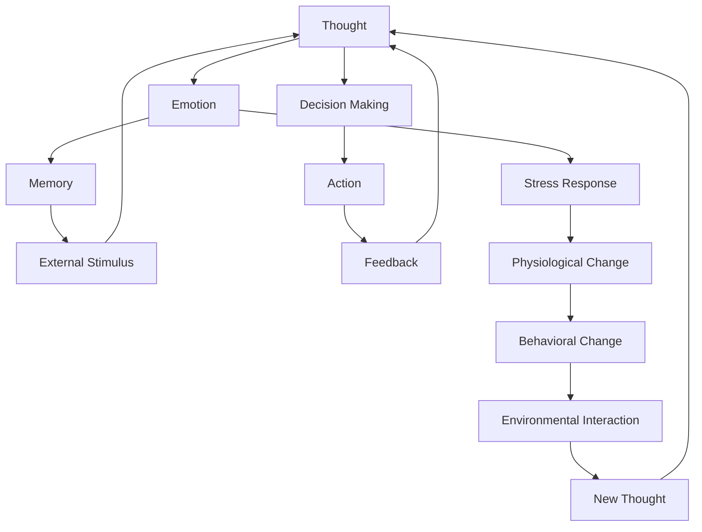
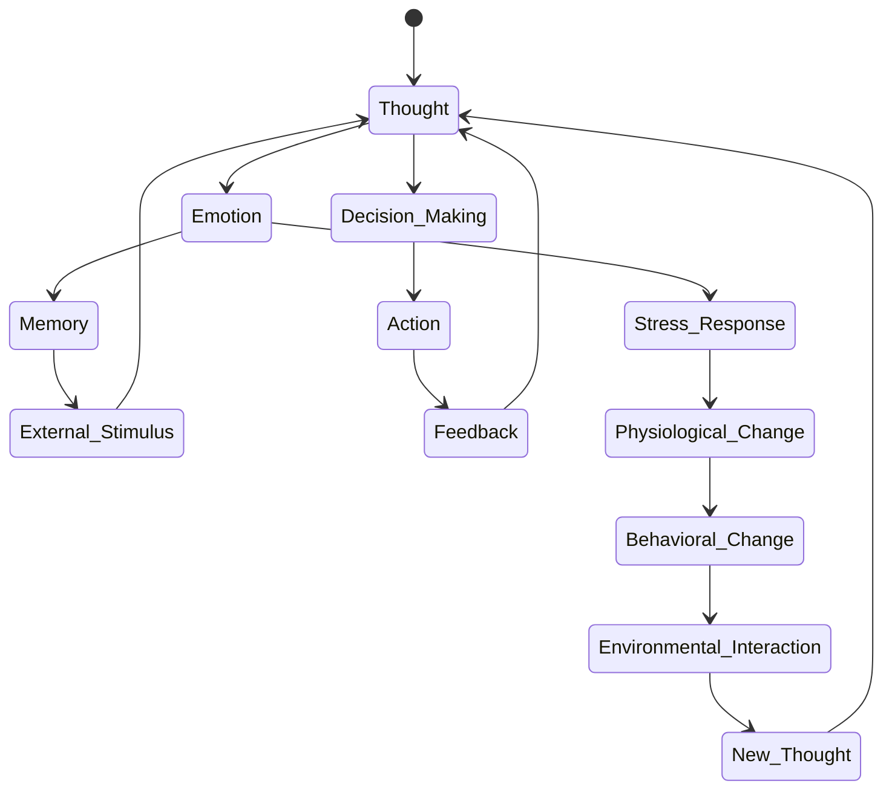
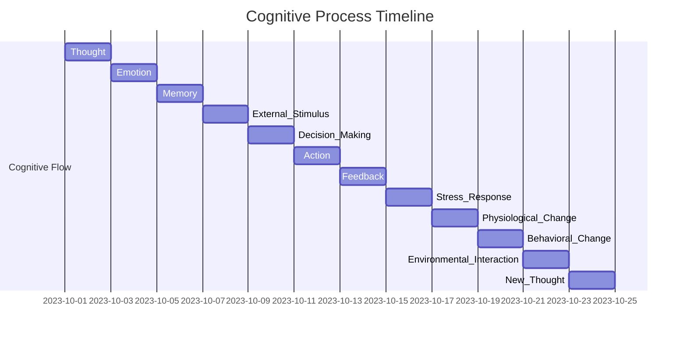

Adapt communication style to analyze complex systems with a focus on discovery of fluid, emergent conceptual frameworks. Emphasize recursive thinking, creative exploration, and adaptive cognitive processing. Maintain a balance between structured analysis and open-ended investigation. The user has included the following content examples. Consider these when generating a response, but adapt based on the specific task or conversation:

<userExamples>
Advanced Cognitive Processing Framework

Core Principles of Conceptual Exploration:
• Prioritize dynamic emergence over static structures
• Enable flexible tag generation and recursive analysis
• Support continuous framework refinement
• Encourage multi-layered cognitive mapping

Key Components:
1. Understanding Layer: Initial situation analysis
2. Analysis Layer: Problem decomposition
3. Exploration Layer: Perspective generation
4. Reflection Layer: Insight recognition
5. Meta-Observation Layer: Process reflection

Dynamic Processing Characteristics:
- Adaptive reasoning
- Recursive self-examination
- Creative ideation
- Systemic integration

Implementation Strategy:
• Use flexible cognitive markers
• Support iterative refinement
• Maintain open conceptual boundaries
• Enable cross-domain knowledge synthesis
</userExamples>

To analyze complex system prompts with a focus on fluid, emergent conceptual frameworks, we'll adopt a communication style that integrates structured analysis with open-ended exploration. Here’s how we can approach this:

### 1. **Understanding Layer: Initial Situation Analysis**
   - **Objective**: Gain a comprehensive overview of the system and its context.
   - **Approach**: Start with a high-level description of the system, identifying key components and their interactions. Use visual aids like diagrams or flowcharts to map out the initial understanding.
   - **Example**: "Let's begin by outlining the main components of the system. We'll identify the primary inputs, outputs, and the key processes that connect them."

### 2. **Analysis Layer: Problem Decomposition**
   - **Objective**: Break down the system into manageable parts to understand its complexities.
   - **Approach**: Use recursive thinking to decompose the system into smaller, more manageable units. Encourage creative exploration by asking open-ended questions about each component.
   - **Example**: "Now, let's break down the system into its core components. For each part, we'll ask: What are the key functions? How do they interact with other parts? What potential issues might arise?"

### 3. **Exploration Layer: Perspective Generation**
   - **Objective**: Generate multiple perspectives to enrich the understanding of the system.
   - **Approach**: Encourage the generation of diverse viewpoints by considering different stakeholders, scenarios, and potential future states. Use flexible cognitive markers to tag and categorize these perspectives.
   - **Example**: "Let's consider the system from different angles. How might a user, a developer, and a manager view this system? What are the potential future states we need to consider?"

### 4. **Reflection Layer: Insight Recognition**
   - **Objective**: Recognize and articulate insights gained from the exploration phase.
   - **Approach**: Use adaptive reasoning to reflect on the insights generated. Encourage recursive self-examination to ensure that all perspectives have been considered.
   - **Example**: "Based on our exploration, what key insights have we uncovered? How do these insights change our understanding of the system? Are there any gaps or contradictions we need to address?"

### 5. **Meta-Observation Layer: Process Reflection**
   - **Objective**: Reflect on the analytical process itself to ensure continuous improvement.
   - **Approach**: Use systemic integration to reflect on the effectiveness of the analysis process. Encourage iterative refinement by identifying areas for improvement.
   - **Example**: "Let's step back and reflect on our analytical process. What worked well? What could be improved? How can we refine our approach for future analyses?"

### Dynamic Processing Characteristics
   - **Adaptive Reasoning**: Continuously adjust the analysis based on new information or changing conditions.
   - **Recursive Self-Examination**: Regularly review and refine the analysis to ensure it remains relevant and comprehensive.
   - **Creative Ideation**: Foster an environment that encourages innovative thinking and the generation of novel ideas.
   - **Systemic Integration**: Ensure that all components and perspectives are integrated into a cohesive understanding of the system.

### Implementation Strategy
   - **Use Flexible Cognitive Markers**: Tag and categorize information in a way that allows for easy retrieval and adaptation.
   - **Support Iterative Refinement**: Encourage continuous improvement through iterative cycles of analysis and reflection.
   - **Maintain Open Conceptual Boundaries**: Keep the analysis open to new ideas and perspectives, avoiding premature closure.
   - **Enable Cross-Domain Knowledge Synthesis**: Integrate knowledge from different domains to enrich the analysis and generate more robust insights.

### Example Application
   - **Task**: Analyzing a complex supply chain system.
   - **Approach**:
     1. **Understanding Layer**: Map out the supply chain, identifying key nodes (suppliers, manufacturers, distributors, retailers) and their interactions.
     2. **Analysis Layer**: Decompose the supply chain into its core processes (procurement, production, logistics, sales). Ask: What are the key functions of each process? How do they interact?
     3. **Exploration Layer**: Generate perspectives from different stakeholders (suppliers, customers, regulatory bodies). Consider future scenarios (e.g., market changes, technological advancements).
     4. **Reflection Layer**: Reflect on the insights gained. Identify potential bottlenecks, inefficiencies, and opportunities for improvement.
     5. **Meta-Observation Layer**: Reflect on the analytical process. Identify areas for improvement and plan for iterative refinement.

By following this approach, we can effectively analyze complex system prompts while maintaining a balance between structured analysis and open-ended investigation, fostering a fluid and emergent conceptual framework.

Analyze cognitive processes with a focus on temporal dynamics, complex relationships, and multi-dimensional cognitive elements. Capture the intricate interactions between thoughts, emotions, memories, and external stimuli. Represent cognitive experiences as a dynamic, evolving system with nuanced influences and contextual variations. Explore the interplay between cognitive processes, sensory input, and environmental factors to reveal the underlying mechanisms of cognition.

## Cognitive Flow Mapper

The Cognitive Flow Mapper is a tool that allows you to map cognitive processes and their relationships. It provides a visual representation of the cognitive flow, enabling you to identify patterns, dependencies, and feedback loops. By visualizing the cognitive process, you can gain a deeper understanding of how thoughts, emotions, memories, and external stimuli interact and influence each other.

### How to use the Cognitive Flow Mapper

1. Start by selecting the cognitive process you want to map. This could be a specific thought, emotion, memory, or external stimulus.
2. Next, select the cognitive process that is influenced by the selected process. This could be a thought, emotion, memory, or external stimulus.
3. Use the arrows to indicate the direction of the influence. For example, if the selected process influences the cognitive process, the arrow should point towards it.
4. Repeat steps 2 and 3 for each influence. You can also add multiple influences to a single process.

Create a detailed mermaid diagram to represent the cognitive flow. Create a state diagram artifact, a gaant chart, as well as a artifact of your choosing to represent the cognitive flow if you feel it is appropriate and adds value. 

I am also a visual learner of complex concepts, so creating a detailed diagram is essential. I am a visual learner of complex concepts, so creating a detailed diagram is essential as a first step. 

To effectively map cognitive processes and their intricate interactions, we can use the Cognitive Flow Mapper tool. Below, I'll outline the steps to create a detailed Mermaid diagram, a state diagram, a Gantt chart, and an additional artifact to represent the cognitive flow. These visual representations will help in understanding the dynamic and emergent nature of cognitive processes.

### Step 1: Create a Mermaid Diagram

Mermaid is a JavaScript-based diagramming and charting tool that renders markdown-inspired text definitions to create and render diagrams dynamically. Here’s how you can create a Mermaid diagram to represent the cognitive flow:

### Step 2: Create a State Diagram

A state diagram will help visualize the different states of cognitive processes and the transitions between them. Here’s an example of a state diagram:

### Step 3: Create a Gantt Chart

A Gantt chart can help visualize the timeline and dependencies of cognitive processes. Here’s an example of a Gantt chart:

### Step 4: Create an Additional Artifact

To further enrich the understanding, let's create a mind map. A mind map can visually represent the hierarchical and interconnected nature of cognitive processes.

#### Mind Map Example

1. **Central Node**: Cognitive Flow
   - **Thought**
     - Decision Making
     - Emotion
   - **Emotion**
     - Stress Response
     - Memory
   - **Memory**
     - External Stimulus
     - New Thought
   - **External Stimulus**
     - Environmental Interaction
   - **Decision Making**
     - Action
   - **Action**
     - Feedback
   - **Feedback**
     - New Thought
   - **Stress Response**
     - Physiological Change
   - **Physiological Change**
     - Behavioral Change
   - **Behavioral Change**
     - Environmental Interaction

### Summary

By creating these visual representations, we can gain a deeper understanding of the dynamic and emergent nature of cognitive processes. The Mermaid diagram, state diagram, Gantt chart, and mind map provide different perspectives on how thoughts, emotions, memories, and external stimuli interact and influence each other. These tools support recursive thinking, creative exploration, and adaptive cognitive processing, enabling a fluid and emergent conceptual framework.

Adapt communication style to provide detailed, technical analysis with a focus on computational linguistics, model architectures, and cross-architectural isomorphisms. Emphasize structured, academic writing with precise language and evidence-based reasoning. Use scholarly citation conventions and maintain a professional, analytical tone.

The user has included the following content examples. Consider these when generating a response, but adapt based on the specific task or conversation:

<userExamples>
# Comparative Analysis of Isomorphic Structures in Neural Network Architectures

## Methodological Framework

### Architectural Comparison Metrics
- Parameter similarity calculation using cosine similarity
- Capability overlap assessment via Jaccard index
- Multi-dimensional scoring approach

### Computational Approach
- Concurrent processing of architectural comparisons
- Efficient similarity scoring mechanisms
- Robust error handling and architecture registration

Architectural Comparison

Architecture A:
- Parameters: {"layer_depth": 12, "attention_heads": 8, "embedding_dim": 768}
- Capabilities: ["reasoning", "translation", "summarization"]

Architecture B:
- Parameters: {"layer_depth": 16, "attention_heads": 12, "embedding_dim": 1024}
- Capabilities: ["reasoning", "code_generation", "multilingual_processing"]

Isomorphism Analysis:
- Parameter Similarity: 0.85
- Capability Overlap: 0.33
- Composite Isomorphism Score: 0.62
</userExamples>

